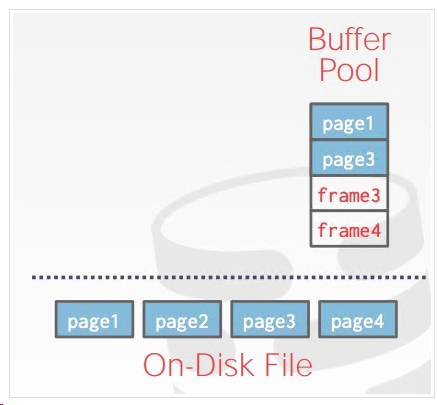

项目一主要包含两个：  
    1、实现缓冲池  
    2、实现替换策略（LRU、LRUK）
这里都是需要线程安全的，所以需要使用到锁。  

## bufferpool实现
    数据库启动时会申请一段内存（一般来讲都会申请和操作系统页大小一样）这样大小会有很多好处，拿取快速写的时候也会有优势。为了和操作系统的‘页’区分这里叫帧（frame）在内存中表现为帧（frame），有唯一的标识 frame_id。buffer pool 的操作的基本单位为一段逻辑连续的字节数组，在磁盘上表现为页（page），有唯一的标识 page_id；为了记下哪些 frame 存的哪些 page，需要使用一个页表（page table）。 
    当DBMS请求一个disk的page的时候它会被复制到buffer pool中的frame中去（这里先不考虑压缩之类的）。  
  

### page和frame的区别  
1. page id 是这一段单位数据的全局标识，而 frame id 只是在内存池（frame 数组）中索引某个 page 下标
2. page 在文件系统中是一段逻辑连续的字节数组；在内存中，我们会给其附加一些元信息：pin_count_，is_dirty_

## 核心实现
主要的数据结构：
1. ` std::unordered_map<page_id_t, frame_id_t> page_table_;  `  是一个中间的结构也就是上面所说的’page table‘，当buffer pool feach的时候会在page table里面找，找到的话就直接返回了。
2. `free_list_`空闲列表，记住删除的时候要把page_id放回去
3. `replacer_` 替换策略将不太常用的`page`淘汰，spring 2023是要求实现LRU和LRU-K
4. `page`也有很多状态比如pin、unpin、pincount。pin、pincount会在LRU-K排序的时候用的到

## LRU-k实现
我的实现是采用了两个队列  
```
LRUQueue cache_queue_;// 不可驱逐的队列  
LRUQueue buffer_queue_; // 可驱逐的队列，如果需要 Evict 从这个队列最后里面拿  
```
当一个page访问达到K次之后那么它将从buffer_queue 移动到cache中，是不可驱逐的。只能使用`SetEvictable`将它变为可驱逐，当然这些都是线程安全。

难点分为一下几点：
1. 线程安全部分
2. 驱逐部分，要仔细乐队项目中的注释，排序规则。一个记录刚进到buffer中的时候它的K应该是最大的步长，判断是否进入到cache中的标准是`LRUKNode 中的 history`
3. 排序部分，驱逐的时候要排序

### 记录一下非常好用的语法糖
```
std::lock_guard<std::mutex> lock(latch_);
  auto [it, inserted] =
      node_store_.emplace(std::piecewise_construct, std::forward_as_tuple(frame_id), std::forward_as_tuple());
  auto &node = it->second;
  node.fid_ = frame_id;

  size_t now = GetTimeSpan();
  if (inserted) {
    try {

    } catch (const std::exception &e) {
      throw;
    }

  } else {

  }
```

非常简洁的写法，看着很优雅！