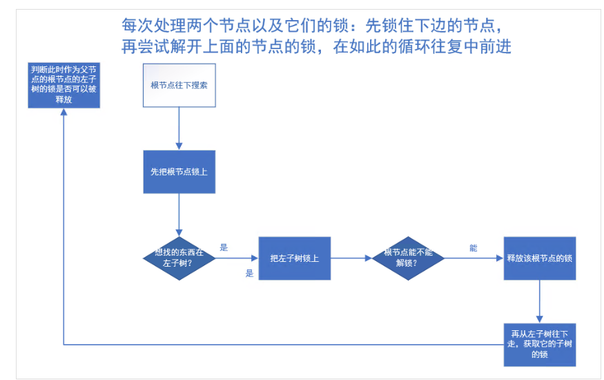

# project2 项目主要实现功能
    1. B+树的增删改查
    2. 树的迭代器
    3. 树的多线程控制
   
# BPlusTree原理简介
B+树是一种数据结构，是一个N叉排序树，每个节点通常有多个孩子，一棵B+树包含根节点、内部节点和叶子节点。根节点可能是一个叶子节点， 也可能是一个包含两个或两个以上孩子节点的节点。  
1. 有 n 棵子树的节点中含有 n-1 个关键字（即将区间分为 n 个子区间，每个子区间对应一棵子树）
2. 所有叶子节点中包含了全部关键字的信息，及指向含这些关键字记录的指针，且叶子节点本身依关键字的大小自小而大顺序链接
3. 所有的非叶子节点可以看成是索引部分，节点中仅含有其子树（根节点）中的最大（或最小）关键字。
4. 除根节点外，其他所有节点中所含关键字的个数最少有 {m}/{2}（注意：B 树中除根以外的所有非叶子节点至少有
{m}/{2} 棵子树

# 项目中的增删查
## 基本类介绍
### BPlusTreePage 
bplustree的基类leaf和internal节点都要继承它。需要增加一些属性例如max/min size以及parent page等，这些在后面的合并和借的时候会用到。 

### BPlusTreeInternalPage
这个类重点写一下我觉得非常重要，在增加、删除、查找时都要internal节点：
1. internal节点由于下面有子节点，它是有0号未的，但是它的0号位在查找的时候是用不到的（遵循着左边的子节点都比它小右边的都比它大的原则）而且0号位很重要在合并或者借节点时要把0号未的值更新到新的父节点，所以internal节点是可以有m个值的要在m+1的时候才会分裂  

简单贴一下其中一个比较重要的函数
```
auto B_PLUS_TREE_INTERNAL_PAGE_TYPE::FindSuitInternalPage(const KeyType &key, const KeyComparator &compara,
                                                          SeachMode mode) const -> ValueType {
  assert(GetSize() >= 1);
  if (mode == SeachMode::MIN) {
    return array_[0].second;
  }

  if (mode == SeachMode::MAX) {
    return array_[GetSize() - 1].second;
  }

  if (compara(key, array_[1].first) < 0) {
    return array_[0].second;
  }

  if (compara(key, array_[GetSize() - 1].first) >= 0) {
    return array_[GetSize() - 1].second;
  }

  // int left =1;
  // int right = GetSize()-1;
  // int index = -1;
  // while (left <= right)
  // {
  //   int mid = left + (right - left) / 2;
  //   if(compara(array_[mid].first,key) > 0){
  //     right = mid - 1;
  //     index = right;
  //   }else{
  //     left = mid + 1;
  //   }
  // }
  // if(index == -1){
  //   return array_[GetSize() - 1].second;
  // }
  // return array_[index -1].second;
  // 从第二个节点开始
  for (int i = 1; i < GetSize(); i++) {
    KeyType cur_key = array_[i].first;
    if (compara(key, cur_key) < 0) {
      return array_[i - 1].second;
    }
  }
  return array_[GetSize() - 1].second;
}
```
最开始用的二分后面好像出问题提了，又改用了普通的方法找，不过要提高效率还是要用二分法好一些。  

### BPlusTreeLeafPage
这个类略过吧

## 插入
```
    root_mutex_.unlock();
    page_id_t leaf_page_id;
    Context ctx;
    ctx.op_type_ = OpType::INSERT;

    // 找到页节点ID和它的父ID
    FindSuitLeafNode(key, leaf_page_id, ctx);
    auto guard = bpm_->FetchPageBasic(leaf_page_id);
    auto leaf_node = guard.template AsMut<LeafPage>();
    if (leaf_node == nullptr) {
      throw Exception(" reinterpret_cast to LeafPage failed");
    }

    if (leaf_node->KeyExist(key, comparator_)) {
      ReleaseAllLatchAndRoot(ctx);
      return false;
    }

    leaf_node->Insert(key, value, comparator_);

    test_set_.emplace_back(key);

    if (leaf_node->GetSize() == leaf_node->GetMaxSize()) {
      // 分裂
      auto new_leaf_node = Split(leaf_node);
      auto new_leaf_guard = bpm_->FetchPageBasic(new_leaf_node->GetPageID());
      auto new_leaf_node1 = new_leaf_guard.template AsMut<LeafPage>();

      InsertIntoParentNode(leaf_node, new_leaf_node1->KeyAt(0), new_leaf_node1, ctx);
    }
```
总结一下步骤：
1. 找到合适的叶子节点
2. 判断是否存在
3. 插入  
这里面最重要的是`InsertIntoParentNode`函数它是一个递归方法先贴出算法  
  
递归首先要确定终止条件这里面的条件有两个：
1. 插入到的internal节点小于等于m个不需要分裂了
2. 最终递归到需要一个新的root节点

新根节点的情况
```
    left_node->SetParentPageID(new_root_id);
    right_node->SetParentPageID(new_root_id);

    new_root_page->IncreaseSize(2);
    if (left_node->IsLeafPage()) {
      auto node = reinterpret_cast<LeafPage *>(left_node);
      new_root_page->SetKeyAt(0, node->KeyAt(0));
    } else {
      auto node = reinterpret_cast<InternalPage *>(left_node);
      new_root_page->SetKeyAt(0, node->KeyAt(1));
    }

    new_root_page->SetValueAt(0, left_id->GetPageID());
    new_root_page->SetKeyAt(1, key);
    new_root_page->SetValueAt(1, need_merge_id->GetPageID());
```
非根节点的情况
```
    auto parent_guard = bpm_->FetchPageBasic(left_node->GetParentPageID());
    auto parent_node = parent_guard.template AsMut<InternalPage>();
    parent_node->InsertNodeAterVal(left_id->GetPageID(), key, need_merge_id->GetPageID());

    if (parent_node->GetSize() == parent_node->GetMaxSize() + 1) {
      // 父节点需要分裂 递归上去
      auto new_page = Split(parent_node);
      auto new_page_guard = bpm_->FetchPageBasic(new_page->GetPageID());
      LockPage(ctx, new_page->GetPageID());

      auto new_node = new_page_guard.template AsMut<InternalPage>();

      InsertIntoParentNode(parent_node, new_node->KeyAt(0), new_node, ctx);
    }
```

## 删除
删除算法：
1. 找到合适的leaf节点
2. 删除leaf中的value值
3. 如果leaf值大于m/2返回，小于则优先合并合并不了就从兄弟节点借

核心代码
```
page_id_t left_sibling_id = INVALID_PAGE_ID;
  page_id_t right_sibling_id = INVALID_PAGE_ID;

  if (index != 0) {
    left_sibling_id = parent_node->ValueAt(index - 1);
  }

  if (index != parent_node->GetSize() - 1) {
    right_sibling_id = parent_node->ValueAt(index + 1);
  }
  bool distribute_suc = false;
  // 判断左边是否可以合并
  if (left_sibling_id != INVALID_PAGE_ID) {
    auto left_sibling_guard = bpm_->FetchPageBasic(left_sibling_id);
    auto left_sibling_node = left_sibling_guard.template AsMut<BPlusTreePage>();
    if (NeedMerge(left_sibling_node, node)) {
      bool delete_node = Merge(parent_node, index, node, left_sibling_node, ctx);
      return delete_node;
    }
  }

  // 判断右边是否可以合并
  if (right_sibling_id != INVALID_PAGE_ID) {
    auto right_sibling_guard = bpm_->FetchPageBasic(right_sibling_id);
    auto right_sibling_node = right_sibling_guard.template AsMut<BPlusTreePage>();
    if (NeedMerge(node, right_sibling_node)) {
      auto pass_no = node;
      bool delete_node = Merge(parent_node, index + 1, right_sibling_node, pass_no, ctx);
      return delete_node;
    }
  }

  // 从左右兄弟借节点

  if (left_sibling_id != INVALID_PAGE_ID) {
    auto left_sibling_guard = bpm_->FetchPageBasic(left_sibling_id);
    auto left_sibling_node = left_sibling_guard.template AsMut<BPlusTreePage>();
    if (left_sibling_node->GetSize() - 1 >= left_sibling_node->GetMinSize()) {
      distribute_suc = true;
      Redistribute(left_sibling_node, node);
    }
  }

  if (right_sibling_id != INVALID_PAGE_ID && !distribute_suc) {
    auto right_sibling_guard = bpm_->FetchPageBasic(right_sibling_id);
    auto right_sibling_node = right_sibling_guard.template AsMut<BPlusTreePage>();
    if (right_sibling_node->GetSize() - 1 >= right_sibling_node->GetMinSize()) {
      distribute_suc = true;
      Redistribute(node, right_sibling_node);
    }
  }
  assert(distribute_suc);
  return false;
```

internal节点的细节还是很多的
贴一个细节较多的函数
```
void B_PLUS_TREE_INTERNAL_PAGE_TYPE::MoveFirstToBack(BPlusTreeInternalPage *recipient, BufferPoolManager *bpm) {
  int size = GetSize();
  assert(size > 1);
  // 0 位把key/val取出来准备移动到左边，原来的1位变为0
  KeyType key = KeyAt(0);
  ValueType val = ValueAt(0);
  SetValueAt(0, ValueAt(1));
  SetKeyAt(0, KeyAt(1));
  Remove(1);
  MappingType item{key, val};
  page_id_t parent_id = GetParentPageID();
  auto parent_page_guard = bpm->FetchPageBasic(parent_id);
  auto parent_node = parent_page_guard.template AsMut<BPlusTreeInternalPage>();
  int cur_index = parent_node->ValueIndex(GetPageID());
//更新父节点的key
  parent_node->SetKeyAt(cur_index, KeyAt(0));

  auto move_page_guard = bpm->FetchPageBasic(item.second);
  auto move_node = move_page_guard.template AsMut<BPlusTreePage>();
  move_node->SetParentPageID(recipient->GetPageID());
//移动
  recipient->CopyLastFrom(&item);
}
```
移动的时候本来想使用memmove 但是就是编译不过，所以只能一个个移动了

## 多并发的增删查

采用的是”crabbing/coupling”
  
判断能否放开父节点的锁的条件是父节点不会发生分裂或者合并，即父节点的数量大于等于m/2小于m-1。当然也会根据当前的操作来判断如果是查询操作的话就是安全的直接释放父节点。  
锁page的代码
```
  inline void LockPage(Context &ctx, const page_id_t &id) {
    if (ctx.op_type_ == OpType::SELECT) {
      ctx.read_set_.emplace_back(bpm_->FetchPageRead(id));
      return;
    }
    ctx.write_set_.emplace_back(bpm_->FetchPageWrite(id));
  }
```
需要注意的是在多并发查询的时候需要额外的一把锁来所住逻辑上的root不要只锁住page因为root可能会在插入删除的时候改变，当root安全的时候再放开。

## 感想
现在回头看自己的代码还是有点丑的，当时思维被困住了现在回头看有好多地方可以改的效率更加高。等没那么忙的时候再修改一版本看看性能。