# 现代控制理论
## 事务（Transactions）
transaction 是 DBMS 状态变化的基本单位，一个 transaction 只能有执行和未执行两个状态，不存在部分执行的状态

### 四个特征
#### 1.Atomicity
Transaction 执行只有两种结果：  
在完成所有操作后 Commit  
在完成部分操作后主动或被动 Abort  
DBMS 需要保证 transaction 的原子性，即在使用者的眼里，transaction 的所有操作要么都被执行，要么都未被执行。回到之前的转账问题，如果 A 账户转 100 元到 B 账户的过程中忽然停电，当供电恢复时，A、B 账户的正确状态应当是怎样的？--- 回退到转账前的状态。如何保证？
##### Logging
DBMS 在日志中按顺序记录所有 actions 信息，然后 undo 所有 aborted transactions 已经执行的 actions，出于审计和效率的原因，几乎所有现代系统都使用这种方式。
#### 2.Consistency
如果 DBMS 在 transaction 开始之前是 consistent，那么在执行完毕后也应当是 consistent。Transaction consistency 是 DBMS 必须保证的事情。举个例子银行转钱前后总额是不变的
#### 3.Isolation
用户提交 transactions，不同 transactions 执行过程应当互相隔离，互不影响，每个 transaction 都认为只有自己在执行。
DBMS 如何认定多个 transactions 的重叠执行方式是正确的。总体上看，有两种 protocols：  
Pessimistic：不让问题出现，将问题扼杀在摇篮之中  
Optimistic：假设问题很罕见，一旦问题出现了再行处理
#### 4.Durability
持久化，现代DBMS基本上都是按照log的形式实现

#### 概念
Serial Schedule: 不同 transactions 之间没有重叠

Equivalent Schedules: 对于任意数据库起始状态，若两个 schedules 分别执行所到达的数据库最终状态相同，则称这两个 schedules 等价

Serializable Schedule: 如果一个 schedule 与 transactions 之间的某种 serial execution 的效果一致，则称该 schedule 为 serializable schedule

#### Conflicting Operations
在对 schedules 作等价分析前，需要了解 conflicting operations。当两个 operations 满足以下条件时，我们认为它们是 conflicting operations：  
1. 来自不同的 transactions
2. 对同一个对象操作
3. 两个 operations 至少有一个是 write 操作

## 事务级别的锁
Locks 有两种基本类型：  
S-LOCK：共享锁 (读锁)  
X-LOCK：互斥锁 (写锁)也有叫独占锁  
  
DBMS 中有个专门的模块，lock manager，负责管理系统中的 locks，每当事务需要加锁或者升级锁的时候，都需要向它发出请求，lock manager 内部维护着一个 lock table，上面记录着当前的所有分配信息，lock manager 需要根据这些来决定赋予锁还是拒绝请求，以保证事务操作重排的正确性和并发度。  
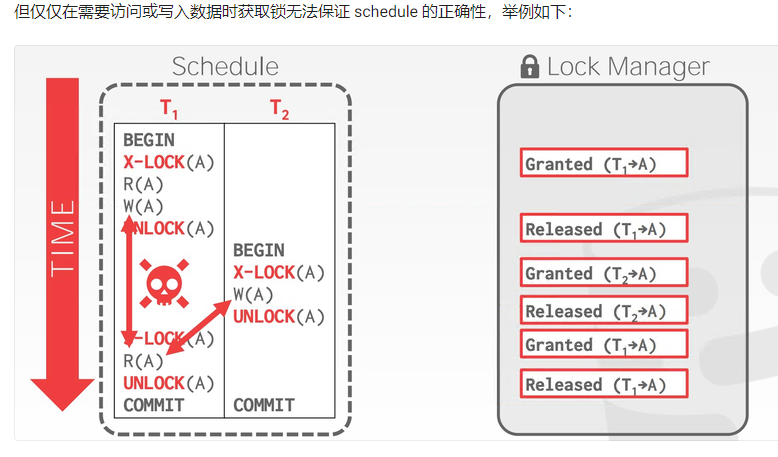  
事务 T1 前后两次读到的数据不一致，出现了幻读，这与顺序执行的结果并不一致。于是我们需要更强的加锁策略，来保证 schedule 的正确性。

### Multiple Granularity
在数据库中，我们不可能一个一个 item 上锁，比如执行 SELECT * FROM demo FOR UPDATE; ，不可能给 demo 中所有的 items 上锁，这不仅需要耗费大量的时间，同时 LockManager 里面也需要耗费大量内存管理 lock。我们完全可以用一个锁来表示整个 table，所以数据库通常采用了树状的锁管理结构。  
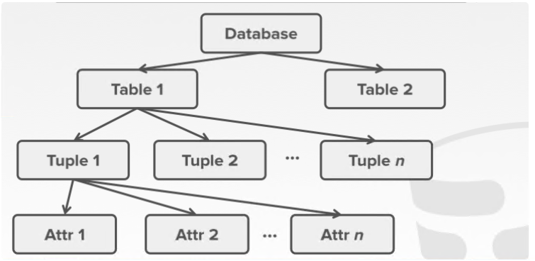  
但是我们要考虑一种情况，假设 
 在 Attr 1 上面有 X 锁，此时 
 需要遍历整一个数据库，也就是在 Database 上面上 S 锁。那么 
 需要先遍历整个树，来判断是否存在和它冲突的锁，这会耗费大量的时间。因此引入 intention lock 来解决这个问题，intention lock 相当于在一个被操作节点的所有父节点上添加了一些额外信息，帮助其他事务不需要遍历整个 lock 树来判断是否存在冲突锁  
 Intention Lock 分为如下三种：
1. Intention-Shared（IS）：表示该节点下的子节点存在 S。
2. Intention-Exclusive（IX）：表示该节点下的子节点存在 X。
3. Shared+Intention-Exclusive（SIX）：表示该节点被加了 S，且其下面子节点存在 X。
   
加锁规则：  
1. 每一个 txn 获得锁的顺序都是从上到下，释放锁的顺序是从下到上。
2. 一个节点获得 S 或 IS 时，其所有父节点获得 IS。
3. 一个节点获得 X 或 IX 或 SIX 时，其所有父节点获得 IX。  

例如一个事务要修改上图 Attr 1 的数据，先在 Database 上 IX 锁，在 Table 1，Tuple 1 逐个上 IX 锁，最后在 Attr 1 上 X 锁。  
下图是两个事务同时上锁的效果：  
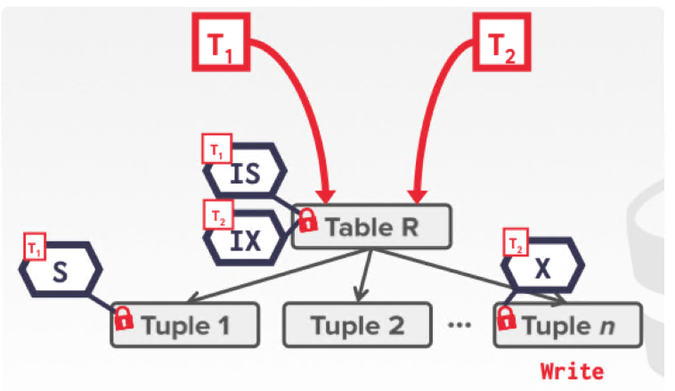  
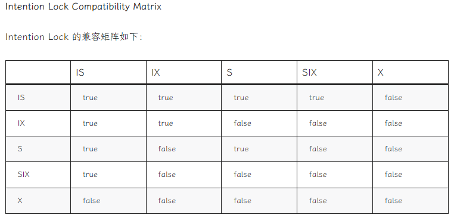

## Two-Phase Locking
2PL，顾名思义，有两个阶段：growing 和 shrinking：  
在 growing 阶段中，事务可以按需获取某条数据的锁，lock manager 决定同意或者拒绝；在 shringking 阶段中，事务只能释放之前获取的锁，不能获得新锁，即一旦开始释放锁，之后就只能释放锁。下图就违背了 2PL 的协议：
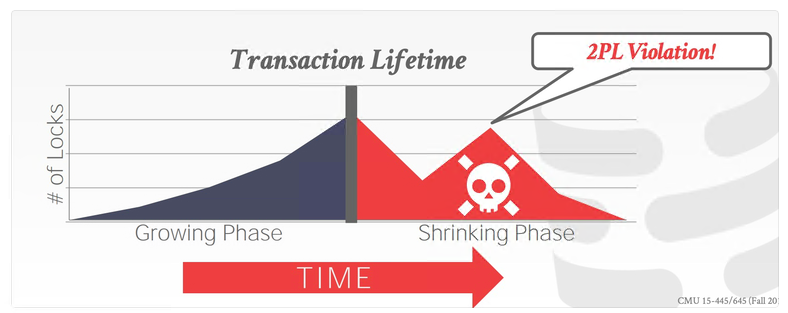  
2PL 本身已经足够保证 schedule 是 serializable，通过 2PL 产生的 schedule 中，各个 txn 之间的依赖关系能构成有向无环图。但 2PL 可能导致级联中止 (cascading aborts)，举例如下：
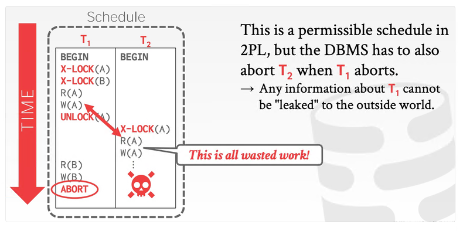  
由于 T1 中止了，T2 在之前读到 T1 写入的数据，就是所谓的 "脏读"。为了保证整个 schedule 是 serializable，DBMS 需要在 T1 中止后将曾经读取过 T1 写入数据的其它事务中止，而这些中止可能进而使得其它正在进行的事务级联地中止，这个过程就是所谓的级联中止。  
事实上 2PL 还有一个增强版变种，Rigorous 2PL，后者每个事务在结束之前，其写过的数据不能被其它事务读取或者重写，如下图所示：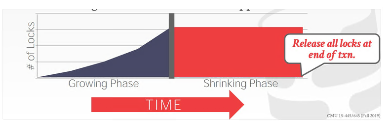

以转账为例，对 Non-2PL、2PL 和 Rigorous 2PL 分别举例：    
Non-2PL：  
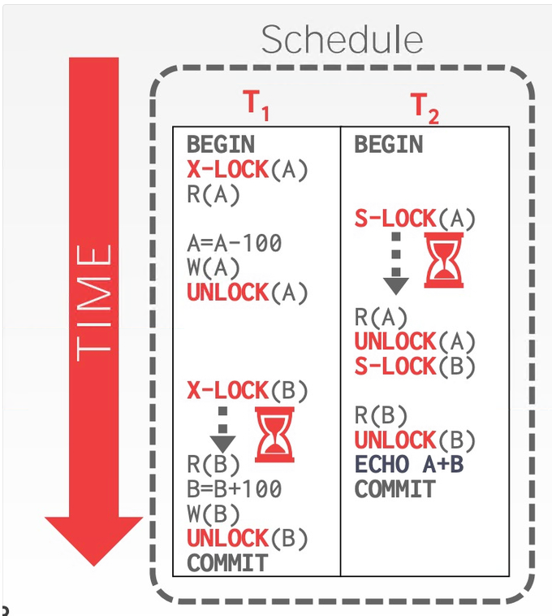  
2PL 举例：  
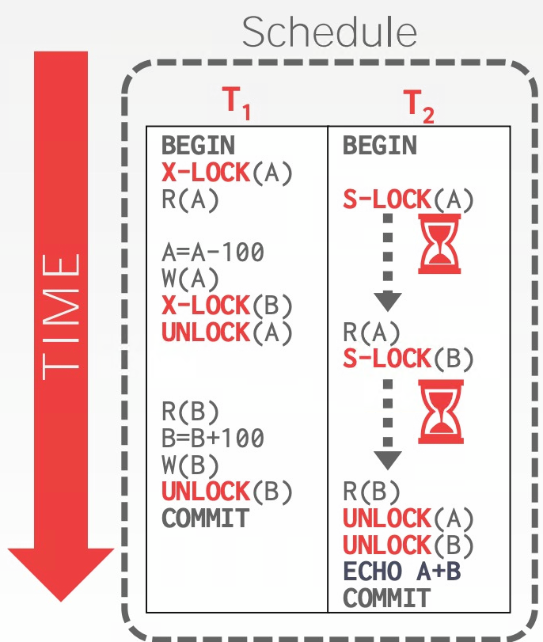  
2PL 输出的结果正确，为 2000，同时可以看到它的并发程度比 Non-2PL 的差一些，但看着还算不错。  
Rigorous 2PL 举例：  
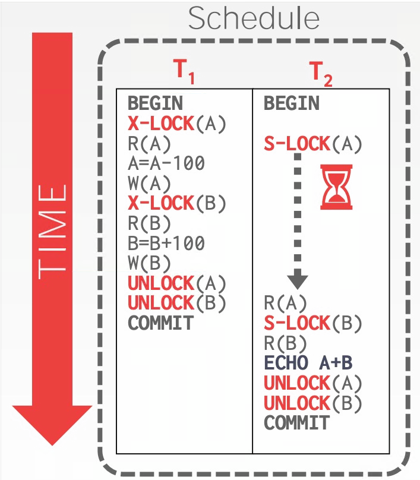  
## Deadlock Detection & Prevention
2PL 无法避免的一个问题就是死锁：  
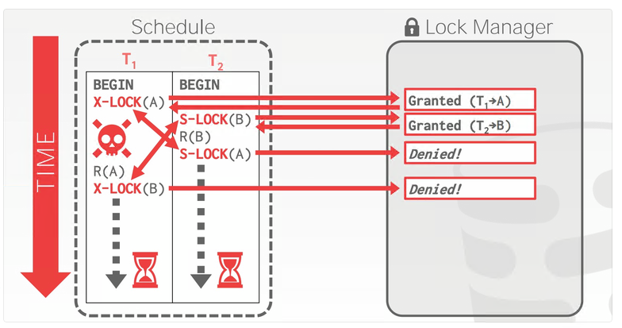  
死锁其实就是事务之间互相等待对方释放自己想要的锁。解决死锁的办法也很常规：

Detection：事后检测

Prevention：事前阻止
### Deadlock Detection
死锁检测是一种事后行为。为了检测死锁，DBMS 会维护一张 waits-for graph，来跟踪每个事务正在等待 (释放锁) 的其它事务，然后系统会定期地检查 waits-for graph，看其中是否有成环，如果成环了就要决定如何打破这个环。  
waits-for graph 中的节点是事务，从 Ti 到 Tj 的边就表示 Ti 正在等待 Tj 释放锁，举例如下：
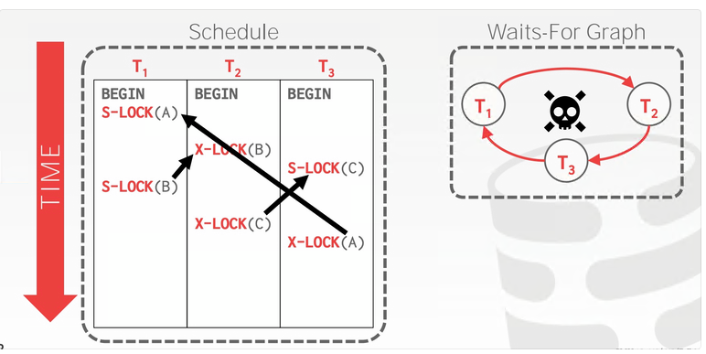  
当 DBMS 检测到死锁时，它会选择一个 "受害者" (事务)，将该事务回滚，打破环形依赖，而这个 "受害者" 将依靠配置或者应用层逻辑重试或中止。这里有两个设计决定：  
检测死锁的频率  
如何选择合适的 "受害者"  

检测死锁的频率越高，陷入死锁的事务等待的时间越短，但消耗的 cpu 也就越多。所以这是个典型的 trade-off，通常有一个调优的参数供用户配置。

选择 "受害者" 的指标可能有很多：事务持续时间、事务的进度、事务锁住的数据数量、级联事务的数量、事务曾经重启的次数等等。在选择完 "受害者" 后，DBMS 还有一个设计决定需要做：完全回滚还是回滚到足够消除环形依赖即可。
### Deadlock Prevention
Deadlock prevention 是一种事前行为，采用这种方案的 DBMS 无需维护 waits-for graph，也不需要实现 detection 算法，而是在事务尝试获取其它事务持有的锁时直接决定是否需要将其中一个事务中止。通常 prevention 会按照事务的年龄来赋予优先级，事务的时间戳越老，优先级越高。有两种 prevention 的策略：  
1. Old Waits for Young：如果 requesting txn 优先级比 holding txn 更高则等待后者释放锁；更低则自行中止
2. Young Waits for Old：如果 requesting txn 优先级比 holding txn 更高则后者自行中止释放锁，让前者获取锁，否则 requesting txn 等待 holding txn 释放锁  

# MVCC

MVCC不止是一个并发控制协议，它由许多部分组成，这些部分包括：
1. Concurrency Control Protocol
2. Version Storage
3. Garbage Collection
4. Index Management

## Concurrency Control Protocol

1. Timestamp Ordering (T/O)：为每个事务赋予时间戳，并用以决定执行顺序
2. Optimistic Concurrency Control (OCC)：为每个事务创建 private workspace，并将事务分为 read, write 和 validate 3 个阶段处理 cmu这个项目采用的就是该协议
3. Two-Phase Locking (2PL)：按照 2PL 的约定获取和释放锁，15-445是采用的这个
   
## Version Storage

如何存储一条数据的多个版本？DBMS通常会在每条数据上拉一条版本链表（version chain），所有相关的索引都会知道这个链表的head，DBMS可以利用它找到一个事务应该给访问到的版本。不同的版本存储方案在version chain上存储的数据不同，主要由3中方案：
1. append-only：新版本通过追加的方式存储在同一张表中
2. Time_travel：老版本被复制到单独的一张表中
3. delta storage：老版本数据的被修改的字段值被复制到一张单独的增量表中

### Append-Only Storage
同一个逻辑数据的所有物理版本都被存储在同一张表上，每次更新时，就往表上追加一个新的版本记录，并在旧版本的数据上增加一个指针指向新版本：
  
也许你已经注意到，指针的方向也可以从新到旧，二者的权衡如下：

Approach #1：Oldest-to-Newest (O2N)：写的时候追加即可，读的时候需要遍历链表
Approach #2：Newest-to-Oldest (N2O)：写的时候需要更新所有索引指针，读的时候不需要遍历链表

### Time-Travel Storage
单独拿一张表 (Time-Travel Table) 来存历史数据，每当更新数据时，就把当前版本复制到 TTT 中，并更新指针：

### Delta Storage
每次更新，仅将变化的字段信息存储到 delta storage segment 中：
  
DBMS 可以通过 delta 数据逆向恢复数据到之前的版本。

## Garbage Collection
随着时间的推移，DBMS 中数据的旧版本可能不再会被用到，如：
1. 已经没有活跃的事务需要看到该版本
2. 该版本是被一个已经中止的事务创建

GC 可以从两个角度出发：
1. Tuple-level：直接检查每条数据的旧版本数据
2. Transaction-level：每个事务负责跟踪数据的旧版本，DBMS 不需要亲自检查单条数据

### Tuple-Level GC
Background Vacuuming

为了加快 GC 的速度，DBMS 可以再维护一个脏页位图 (dirty page bitmap)，利用它，Vacuum 线程可以只检查发生过改动的数据，用空间换时间。Background Vacuuming 被用于任意 Version Storage 的方案。

#### Cooperative Cleaning
还有一种做法是当 worker thread 查询数据时，顺便将不再使用物理数据版本删除：

cooperative cleaning 只能用于使用 O2N 的 version chain 方案。
### Transaction-Level GC
让每个事务都保存着它的读写数据集合 (read/write set)，当 DBMS 决定什么时候这个事务创建的各版本数据可以被回收时，就按照集合内部的数据处理即可。

