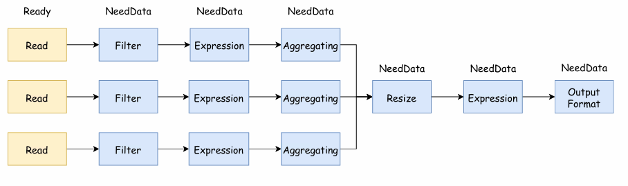
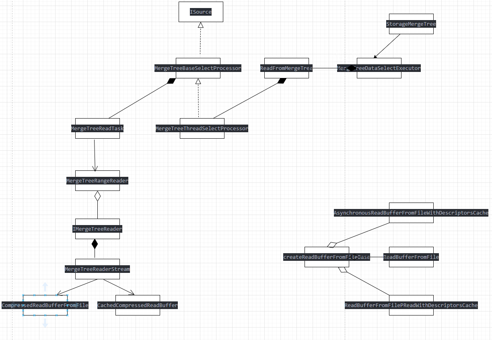

现代模型为了更大的利用磁盘IO性能，同时为了优化计算线程基本上都会采用`分离IO和计算`的设计思路，这样可以使计算线程不必等待IO避免CPU的浪费。  现在来分析一下clickhouse的计算以及IO设计模型，查阅了很多资料也GPT和deepseek了一下没有什么现成的资源可以参考，就只能靠自己来看了  
本文的主要重点是分析clickhouse的计算和IO的分离模型以及它是怎么实现异步IO的，下面简要的介绍一下计算模型。
## 计算模型  
```
sql -> 解释器 -> 优化器（根据规则重写优化）-> 物理计划
这里面的计划会根据max_threads 来以及根据底层的source读取来最大化的分割为几个stream来执行
```

pipeline最终会变成这个样子：  
  
图中变成3个stream，图中的read节点在代码中是source节点，source节点在`生产数据`的时候就会去读。执行步骤：
```
MergeTreeBaseSelectProcessor::readFromPartImpl 
    |
MergeTreeRangeReader::read
    |
MergeTreeRangeReader::Stream::readRows
    |
MergeTreeRangeReader::DelayedStream::readRows (这里抽象了一下根据不同的存储类型有不同的reader)
    |
size_t MergeTreeReaderWide::readRows 这里面实现了异步读的操作
```

## IO线程
先说结论是在readRows中先执行一遍prefetch操作然后再去readRows，异步的读在prefetch中。使用的类是AsynchronousReadBufferFromFileDescriptor但是228分支中使用的不是异步读的标准库libaio或者uring这些只是把`先使用prefetch读数据扔到了另一个线程中然后在readrows中去拿而已算是做了读算分离操作`具体的代码如下
prefetch
```
void AsynchronousReadBufferFromFileDescriptor::prefetch()
{
    if (prefetch_future.valid())
        return;

    /// Will request the same amount of data that is read in nextImpl.
    prefetch_buffer.resize(internal_buffer.size());
    prefetch_future = asyncReadInto(prefetch_buffer.data(), prefetch_buffer.size());
}
```
asyncReadInto  
返回一个future
```
std::future<IAsynchronousReader::Result> AsynchronousReadBufferFromFileDescriptor::asyncReadInto(char * data, size_t size)
{
    IAsynchronousReader::Request request;
    request.descriptor = std::make_shared<IAsynchronousReader::LocalFileDescriptor>(fd);
    request.buf = data;
    request.size = size;
    request.offset = file_offset_of_buffer_end;
    request.priority = priority;
    request.ignore = bytes_to_ignore;
    bytes_to_ignore = 0;

    /// This is a workaround of a read pass EOF bug in linux kernel with pread()
    if (file_size.has_value() && file_offset_of_buffer_end >= *file_size)
    {
        return std::async(std::launch::deferred, [] { return IAsynchronousReader::Result{.size = 0, .offset = 0}; });
    }

    return reader->submit(request);
}
```
ThreadPoolReader  
把read放到线程里面读
```
std::future<IAsynchronousReader::Result> ThreadPoolReader::submit(Request request)
{

    int fd = assert_cast<const LocalFileDescriptor &>(*request.descriptor).fd;

    query_context = CurrentThread::get().getQueryContext();

    auto task = std::make_shared<std::packaged_task<Result()>>([request, fd, running_group, query_context]
    {
        ...
        
        res = ::pread(fd, request.buf, request.size, request.offset);

        ...
        return Result{ .size = bytes_read, .offset = request.ignore };
    });

    auto future = task->get_future();

    /// ThreadPool is using "bigger is higher priority" instead of "smaller is more priority".
    pool.scheduleOrThrow([task]{ (*task)(); }, -request.priority);

    return future;
}
```
准备工作完成，原理大概是通过prefetch将读的操作放到另一个ThreadPool里面读不阻塞计算线程之后再使用readData拿出来，具体代码在
不同的 MergeTreeReader 中，下面贴一个
```
size_t MergeTreeReaderWide::readRows(
    size_t from_mark, size_t current_task_last_mark, bool continue_reading, size_t max_rows_to_read, Columns & res_columns)
{
        {
            /// Request reading of data in advance,
            /// so if reading can be asynchronous, it will also be performed in parallel for all columns.
            for (size_t pos = 0; pos < num_columns; ++pos)
            {
                    prefetch(columns_to_read[pos], serializations[pos], from_mark, continue_reading, current_task_last_mark, cache, prefetched_streams);
            }
        }

        for (size_t pos = 0; pos < num_columns; ++pos)
        {
                readData(
                    column_to_read, serializations[pos], column,
                    from_mark, continue_reading, current_task_last_mark,
                    max_rows_to_read, cache, /* was_prefetched =*/ !prefetched_streams.empty());
        }
}

```
最后贴一下相关的类图方便整理思路
