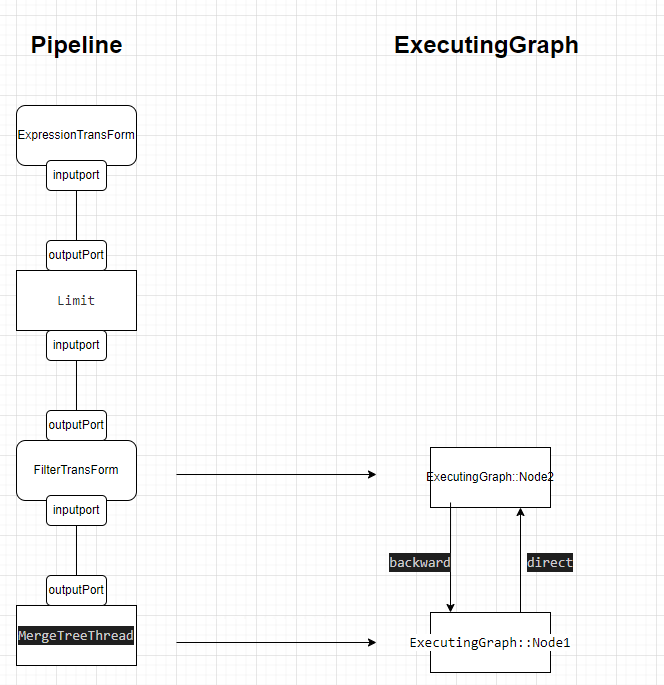

# clickhouse pull模型

数据库的SQL计算引擎负责处理和执行SQL请求。通常来说，查询优化器会输出物理执行计划，它通常由一系列Operator组成，为了确保执行效率的高效，需要将Operator组成流水线执行。

简单地说，Pull流水线基于迭代器模型，经典的火山模型正是基于Pull来构建。火山模型是数据库成熟的 SQL执行方案，该设计模式将关系型代数中的每一种操作抽象成一个Operator，整个 SQL 语句在这种情况下形成一个 Operator树(执行计划树)；通过自顶向下的调用 next 接口，火山模型能够以数据库行为单位处理数据，因此，对于Pull模型来说，这是非常容易理解和实现的：每个Operator都需要实现next()方法，只要将查询计划树构建好，就递归调用即可。  

火山模型有如下特点：
1. 以数据行为单位处理数据，每一行数据的处理都会调用 next 接口。  
2. next 接口的调用，需要通过虚函数机制，相比于直接调用函数，虚函数需要的CPU 指令更多，因此更昂贵。  
以行为单位的数据处理，会导致 CPU 缓存使用效率低下和一些不必要的复杂性：数据库必须记住处理到哪一行，以便处理跳到下一行；其次处理完一行后需要将下一行加载到 CPU 缓存中，而实际上 CPU 缓存所能存储的数据行数远不止一行。
3. 火山模型最大的好处是接口看起来干净而且易懂。由于数据流和控制流在一起，每个Operator有良好的抽象，比如Filter只需要关心如何根据谓词过滤数据，Aggregates只需要关心如何聚合数据

## 重要概念
clickhouse中的流水线模型有以下几个概念构成的
### Node-IProcessor
    数据处理的类，也可以理解为‘算子’。processor接口中 核心两个方法prepare和work方法，prepare里面会更新port的状态（input、output）executer根据更新的状态来找到相邻的process,process是按照状态驱动的，状态类型如下
```
    enum class Status
    {
        /// Processor needs some data at its inputs to proceed.
        /// You need to run another processor to generate required input and then call 'prepare' again.
        NeedData,

        /// Processor cannot proceed because output port is full or not isNeeded().
        /// You need to transfer data from output port to the input port of another processor and then call 'prepare' again.
        PortFull,

        /// All work is done (all data is processed or all output are closed), nothing more to do.
        Finished,

        /// No one needs data on output ports.
        /// Unneeded,

        /// You may call 'work' method and processor will do some work synchronously.
        Ready,

        /// You may call 'schedule' method and processor will return descriptor.
        /// You need to poll this descriptor and call work() afterwards.
        Async,

        /// Processor wants to add other processors to pipeline.
        /// New processors must be obtained by expandPipeline() call.
        ExpandPipeline,
    };
```
### port
    分为input和output能够存储数据
### edge
    用于连接两个port的‘桥’

 
ClickHouse在执行Pipeline之前会把Pipeline转化为ExecutingGraph，简单理解就是把pipeline中每个processor转化为node。pipeline中DAG图的每条连接在转化为ExecutingGraph后都会有两条边，分别为direct_edge 和 backward_edge  



    在pipeline构造的时候根据processors构造出ExecutingGraph，processor会被构造成一个个node
    ```
     /// Graph node. Represents single Processor.
    struct Node
    {
        /// Processor and it's position in graph.
        IProcessor * processor = nullptr;
        uint64_t processors_id = 0;

        /// Direct edges are for output ports, back edges are for input ports.
        Edges direct_edges;
        Edges back_edges;

    ```
    node中比较重要的两个成员就是direct_edges、back_edges，分别对应在output和input

edge的结构如下
```
struct Edge
    {
        Edge(uint64_t to_, bool backward_,
             uint64_t input_port_number_, uint64_t output_port_number_,
             std::vector<void *> * update_list)
            : to(to_), backward(backward_)
            , input_port_number(input_port_number_), output_port_number(output_port_number_)
        {
            update_info.update_list = update_list;
            update_info.id = this;
        }

        /// Processor id this edge points to.
        /// It is processor with output_port for direct edge or processor with input_port for backward.
        uint64_t to = std::numeric_limits<uint64_t>::max();
        bool backward;
        /// Port numbers. They are same for direct and backward edges.
        uint64_t input_port_number;
        uint64_t output_port_number;

        /// Edge version is increased when port's state is changed (e.g. when data is pushed). See Port.h for details.
        /// To compare version with prev_version we can decide if neighbour processor need to be prepared.
        Port::UpdateInfo update_info;
    };
```
重点介绍一下成员：  
to：记录着指向process的id，通过这个id来找到process的地址  
update_info.id：这个id记录着本条边的地址，后面的port更新之后就是通过port中的UpdateInfo来找到与之相关联的process

## clickhouse 流水线
clickhouse 在查询的时候时采用的pull模型，TCPHandker.cpp中调用TCPHandler::processOrdinaryQueryWithProcessors方法。 (1)处构建了一个PullingAsyncPipelineExecutor对象executor，然后不断执行executor的pull方法，pull返回一个布尔值，返回false表示query结束
```
void TCPHandler::processOrdinaryQueryWithProcessors()
{
    auto & pipeline = state.io.pipeline;
    ...
    {
        PullingAsyncPipelineExecutor executor(pipeline);                  //(1)
        ...
        Block block;
        while (executor.pull(block, interactive_delay / 1000))            //(2)
        {
            ...
            if (block)
            {
                if (!state.io.null_format)
                    sendData(block);
            }
        }
```

那么是怎么pull的呢？  
1. 初始化的时候会选择sink节点为初始化节点 
```
    UInt64 num_processors = processors.size();
    for (UInt64 proc = 0; proc < num_processors; ++proc)
    {
        if (graph->nodes[proc]->direct_edges.empty())//没有outputprot的process
        {
            stack.push(proc);
            /// do not lock mutex, as this function is executed in single thread
            graph->nodes[proc]->status = ExecutingGraph::ExecStatus::Preparing;
        }
    } 
```
2. 不停的prepareNode，根据port将状态传递到最前面的source节点
3. source得到数据之后（比如读表）也会在prepareNode设置自身的outputport，然后通过outputport把数据再传出去

下面是`select * from test WHERE b = 3 limit 2`  的状态转换图
```
[lllll]---------processor:name:LazyOutputFormat--NeedData
[lllll]---------processor:name:LimitsCheckingTransform--NeedData
[lllll]---------processor:name:ExpressionTransform--NeedData
[lllll]---------processor:name:Limit--NeedData
[lllll]---------processor:name:FilterTransform--NeedData
[lllll]---------processor:name:MergeTreeThread--Ready
[lllll]---------processor:name:MergeTreeThread--PortFull
[lllll]---------processor:name:FilterTransform--Ready
[lllll]---------processor:name:FilterTransform--PortFull
[lllll]---------processor:name:Limit--PortFull
[lllll]---------processor:name:ExpressionTransform--Ready
[lllll]---------processor:name:ExpressionTransform--PortFull
[lllll]---------processor:name:LimitsCheckingTransform--Ready
[lllll]---------processor:name:LimitsCheckingTransform--PortFull
[lllll]---------processor:name:LazyOutputFormat--Ready
[lllll]---------processor:name:LazyOutputFormat--NeedData
[lllll]---------processor:name:LimitsCheckingTransform--NeedData
[lllll]---------processor:name:ExpressionTransform--NeedData
[lllll]---------processor:name:Limit--NeedData
[lllll]---------processor:name:FilterTransform--NeedData
[lllll]---------processor:name:MergeTreeThread--Ready
[lllll]---------processor:name:MergeTreeThread--Finished
[lllll]---------processor:name:FilterTransform--Finished
[lllll]---------processor:name:Limit--Finished
[lllll]---------processor:name:ExpressionTransform--Finished
[lllll]---------processor:name:LimitsCheckingTransform--Finished
[lllll]---------processor:name:LazyOutputFormat--NeedData
[lllll]---------processor:name:NullSource--Ready
[lllll]---------processor:name:NullSource--Finished
[lllll]---------processor:name:LazyOutputFormat--NeedData
[lllll]---------processor:name:NullSource--Ready
[lllll]---------processor:name:NullSource--Finished
[lllll]---------processor:name:LazyOutputFormat--Ready
[lllll]---------processor:name:LazyOutputFormat--Finished
```

在sink节点中设置inputport
```
IOutputFormat::Status IOutputFormat::prepare()
{
...

        input.setNeeded();//改变了自己的端口状态之后它的updatelists状态会变，这个list存的是edge的指针，通过edge的指针可以找到它指向的process
```

```
(gdb) p *(DB::ExecutingGraph::Edge *) update_info.id
$17 = {to = 4, backward = true, input_port_number = 0, output_port_number = 0, update_info = {update_list = 0x7fff46a9f2d0, id = 0x7fff4ca1d6e0, version = 0, prev_version = 0}}

```
可以看到它指向的process的id为4，这样接下来需要进行prepareProcessor的id为4，id为4的process信息如下
```
(gdb) p (*graph->nodes[4]).processor->getName().c_str()
2023.09.08 05:55:22.103685 [ 40818 ] {} <Trace> SystemLog (system.trace_log): Flushing system log, 3 entries to flush
2023.09.08 05:55:22.113338 [ 40818 ] {} <Debug> DiskLocal: Reserving 1.00 MiB on disk `default`, having unreserved 24.21 GiB.
2023.09.08 05:55:22.113620 [ 40829 ] {} <Trace> SystemLog (system.metric_log): Flushed system log
2023.09.08 05:55:22.113641 [ 40854 ] {} <Debug> DiskLocal: Reserving 1.00 MiB on disk `default`, having unreserved 24.21 GiB.
2023.09.08 05:55:22.120204 [ 40818 ] {} <Trace> system.trace_log (75f03593-070a-4624-8437-a1ba3e9e2bf5): Renaming temporary part tmp_insert_202309_11115_11115_0 to 202309_133739_133739_0.
2023.09.08 05:55:22.120675 [ 40818 ] {} <Trace> SystemLog (system.trace_log): Flushed system log
2023.09.08 05:55:22.121247 [ 40854 ] {} <Trace> system.text_log (1d4c860e-a7eb-43e0-8d67-05261da311d0): Renaming temporary part tmp_insert_202309_11244_11244_0 to 202309_135511_135511_0.
warning: RTTI symbol not found for class 'DB::LimitsCheckingTransform'
warning: RTTI symbol not found for class 'DB::LimitsCheckingTransform'
warning: RTTI symbol not found for class 'DB::LimitsCheckingTransform'
$21 = (const std::__1::basic_string<char, std::char_traits<char>, std::allocator<char> >::value_type *) 0x7fffebbc62a0 "LimitsCheckingTransform"

```
结果和上面的日志输出保持一致
