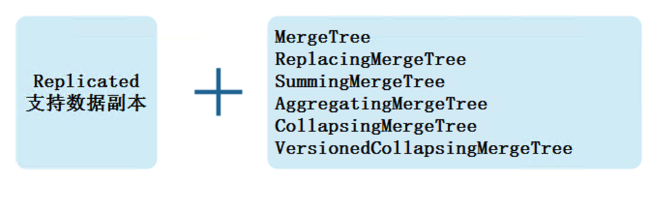
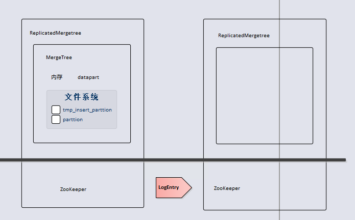
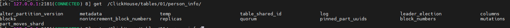
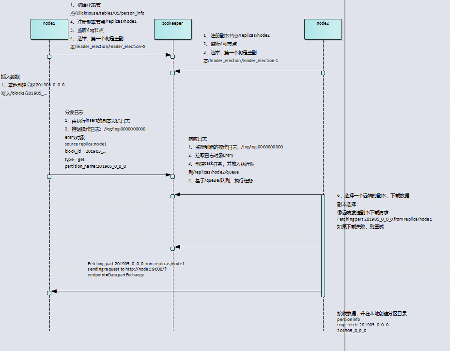

# clickhouse zookeeper数据组织
## 概述
clickhouse集群配置非常灵活，用户可以将所有节点拍成一个单一集群，也可以按照业务的诉求把节点划分成多个小的集群。在每个小的集群区域之间，他们的节点、分区和副本数量可以不同。

副本和分片之间的区别，从数据上面分假设clickhousde的N个节点组成一个集群，在集群的各个节点上都有一张相同的数据表Y。如果N1和N2数据完全相同那么互为副本，如果完全不同则互为分片。

## 副本
存储在ClickHouse中的数据想要有副本，创建表时需要在对应的表引擎前面加上“Replicated”前缀组成一种新的变种引擎，并且目前只有MergeTree系列表引擎才支持副本，如下图所示：


ReplicatedMergeTree是mergetee的派生引擎，在mergetree的基础上加入了分布式协同的能力



在Merge Tree中，一个数据分区由开始创建到全部完成会经历两类存储区域：
1、内存：数据先会被写入内存缓冲区
2、本地磁盘：数据接着会被写入tmp临时目录分区，待全部完成后再将临时目录重新命名为正是目录

语法：
`Engine = ReplicatedMergeTree('zk_path','replica_name')`

zk_path:
在zookeeper中创建的数据表的路径，路径名称可以自定义，用户可以自己定义成希望的任何路径。ClickHouse提供了一些约定俗成的配置模板：/ClickHouse/tables/{shard}/table_name ,其中“/ClickHouse/tables”是约定俗成的路径固定前缀，表示存放数据表的根路径；“{shard}”表示分片编号，通常使用数值代替，例如：01,02,03,一张数据表可以有多个分片，而每个分片都拥有自己的副本；“table_name”表示数据表的名称，通常与物理表的名字相同。

replica_name:
定义在zookeeper中创建的副本名称，该名称是区分不同副本实例的唯一标识，一种约定俗成的命名方式是使用所在服务器的域名称

## 数据结构
创建表
node1
```
Create table person_info(
id UInt32,
name String,
age UInt32,
gender String,
loc String
) engine = ReplicatedMergeTree('/ClickHouse/tables/01/person_info','node1')
partition by loc
order by id;
```
node2
```
Create table person_info(
id UInt32,
name String,
age UInt32,
gender String,
loc String
) engine = ReplicatedMergeTree('/ClickHouse/tables/01/person_info','node2')
partition by loc
order by id;
```

插入数据：
`insert into person_info values (1,'zs',18,'m','beijing'),(2,'ls',19,'f','shanghai'),(3,'ww',20,'m','beijing'),(4,'ml',21,'m','shanghai')`

两个节点都可以查询到数据：
```

┌─id─┬─name─┬─age─┬─gender─┬─loc──────┐
│  2 │ ls   │  19 │ f      │ shanghai │
│  4 │ ml   │  21 │ m      │ shanghai │
└────┴──────┴─────┴────────┴──────────┘
┌─id─┬─name─┬─age─┬─gender─┬─loc─────┐
│  1 │ zs   │  18 │ m      │ beijing │
│  3 │ ww   │  20 │ m      │ beijing │
└────┴──────┴─────┴────────┴─────────┘
```

以上两张表创建完成之后，在zookeeper中会看到创建“/ClickHouse/tables/01/person_info”路径，对此路径下的部分重要目录解释如下：
### 元数据

/metadata:
保存元数据信息，包括主键、分区键、采样表达式。
```
[zk: 192.168.60.142:2181(CONNECTED) 0] get /ClickHouse/tables/01/person_info/metadata
metadata format version: 1
date column:
sampling expression:
index granularity: 8192
mode: 0
sign column:
primary key: id
data format version: 1
partition key: loc
granularity bytes: 10485760
```
/columns：保存列字段信息，包括列名称和数据类型。
```
[zk: 192.168.60.142:2181(CONNECTED) 1] get /ClickHouse/tables/01/person_info/columns
columns format version: 1
5 columns:
`id` UInt32
`name` String
`age` UInt32
`gender` String
`loc` String
```
/replicas:保存副本名称，对应设置参数中的replica_name。
```
[zk: 192.168.60.142:2181(CONNECTED) 2] ls  /ClickHouse/tables/01/person_info/replicas
[node2, node1]
```
### 判断标识
/leader_election:用于主副本的选举工作，主副本主要负责merge、Alter delte 、alter update操作。
```
ls /ClickHouse/tables/01/person_info/leader_election
[leader_election-0]

get /ClickHouse/tables/01/person_info/leader_election/leader_election-0
all (multiple leaders Ok)

```
/blocks:记录block数据块的hash信息摘要，以及对应的partition_id。通过hash能够判断block是否重复；通过partition_id，能够找到需要同步数据的分区

/block_number:按照分区的写入顺序，以相同的顺序记录partition_id。各个副本在merge的时候都会按照相同的block_number顺序进行

/quorum：记录quorum的数量，当至少有quorum数量的副本写入成功后，整个操作才算成功。由insert_quorum参数控制，默认0

### 操作日志
/log:常规操作日志节点（insert、merge、drop partition），保存了副本需要执行的任务指令。使用了zookeeper的持久顺序性节点，每条指令的名称以log-为前缀。每个副本都会监听/log节点，当有新的指令加入时，他们会把指令加入到副本各自的任务队列，并执行

/mutations：当执行（alter、delete、alter update）查询时会添加到这个节点。使用了zookeeper的持久顺序性节点，但是它的命名没有前缀每条数据都是以递增数字的形式保存

/replicas/{replcia_name}/*：每个副本各自的节点下的一组监听节点，用于指导副本在本地执行的任务命令，其中较为重要的有如下几个：

1. /queue:任务队列节点，用于执行具体的操作任务。当副本从/log /mutations节点监听到操作指令时，会将执行任务添加到该节点下，并基于队列执行
2. /log_pointer:log日志指针节点，记录了最后一次执行的log日志下标信息，例如log_pointer：4对应了/log/log-0000000003（从0开始计数）
3. /mutation_pointer:mutation日志指针几点，记录了最后一次执行的mutations的日志名称，例如mutation_pointer：0000000000对应了/mutation/0000000000

## Entry日志对象的数据结构
replicatedMergetree在zookeeper中有两组非常重要的父节点/log /mutations，是分别发送操作指令的信息通道，而发送指令的方式就是为这些父节点添加子节点。所有副本实例都会监听父节点的变化。这些被添加的子节点在clickhouse中被统一抽象为Entry对象，具体由log-entry和mutationEntry对象承载，分别对象/log /mutation节点
### LogEntry核心属性
1. source replica：发送这条log指令的副本来源，对应replica_name
2. type：操作指令类型，主要有get、merge、mutate三种，分别对象从远程副本下载分区、合并分区、mutation操作
3. block_id：当前分区的Block ID，对应/blocks路径下面的子节点
4. partition_name:当前分区目录名称
### MutationEntry 核心属性
1. source replica：发送这条mutation指令的副本来源，对应replica_name
2. commands：操作指令主要有alter delete和alter update
3. mutation_id:mutation的版本号
4. partition_id:当前分区目录的ID
   
## insert核心流程



