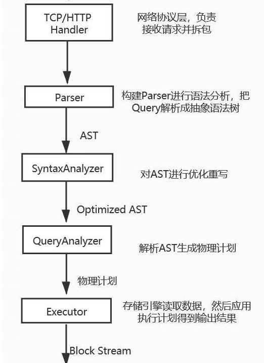

# clickhouse执行计划刨析
## 前置条件
版本 21.3
本文主要探究命中索引
### 创建表
```
CREATE TABLE default.test
(
    `a` Int32,
    `b` Int32,
    `c` Int32,
    INDEX `idx_c` (c) TYPE minmax GRANULARITY 1
)
ENGINE = MergeTree
PARTITION BY a 
ORDER BY b
SETTINGS index_granularity=3，min_bytes_for_wide_part=0
```
### 插入数据
```
insert into default.test(a,b,c) values(1,1,1);
insert into default.test(a,b,c) values(5,2,2),(5,3,3);
insert into default.test(a,b,c) values(3,10,4),(3,9,5),(3,8,6),(3,7,7),(3,6,8),(3,5,9),(3,4,10);
```
## 查询语句与生成的执行计划
`select * from test WHERE b = 3 limit 2`

pipeline
```
┌─explain───────────────────────┐
│ (Expression)                  │
│ ExpressionTransform           │
│   (Limit)                     │
│   Limit                       │
│     (Filter)                  │
│     FilterTransform           │
│       (SettingQuotaAndLimits) │
│         (ReadFromStorage)     │
│         MergeTreeThread 0 → 1 │
└───────────────────────────────┘
```
(ReadFromMergeTree)就是 QueryPlan 中的一个算子，MergeTreeThread则代表实现这个算子向 Pipeline 中添加的 Processor，Processor 后面的数字0 -> 1表示InputPort数量为 0，OutputPort数量为 1，如果 Processor 后面没有数字则默认InputPort和OutputPort数量都是 1。
下面是由上面查询计划画出的dag图

### 怎么生成的执行计划呢？

接下来跟着代码一步步往下走
```
static std::tuple<ASTPtr, BlockIO> executeQueryImpl()
{
    ...
            //在这里解析sql
        ast = parseQuery(parser, begin, end, "", max_query_size, settings.max_parser_depth);
    ...
            //根据语法解析得到相应的解释器,在解释器的构造函数中进行的ast优化重写
        auto interpreter = InterpreterFactory::get(ast, context, SelectQueryOptions(stage).setInternal(internal));
    
}
```
#### 语法解析
```
bool ParserQueryWithOutput::parseImpl(Pos & pos, ASTPtr & node, Expected & expected)
{
    ParserShowTablesQuery show_tables_p;
    ParserSelectWithUnionQuery select_p;
    ...
    //逐个去解析，有一个解析成功就返回
        bool parsed =
           explain_p.parse(pos, query, expected)
        || select_p.parse(pos, query, expected)
```
#### 解释器构造
```
InterpreterSelectQuery::InterpreterSelectQuery(
)
{
    ...
    //优化和重写在这个表达式中
    auto analyze = [&] (bool try_move_to_prewhere)    
    {
        ...
        //主要逻辑在TreeRewriter中
        syntax_analyzer_result = TreeRewriter(*context).analyzeSelect(        
    }

}
```
#### 解释器构造query plan
```
void InterpreterSelectQuery::executeImpl
{
    //analysis_result是构造中优化后的结果
   auto & expressions = analysis_result;    
        ...
            /// Read the data from Storage. from_stage - to what stage the request was completed in Storage.
            //读表的计划在这个里面
        executeFetchColumns(from_stage, query_plan);
        ...
        //根据优化之后的result，加入where
            if (expressions.hasWhere())
                executeWhere(query_plan, expressions.before_where, expressions.remove_where_filter);  
             ...
        //加入limit
                !query.arrayJoinExpressionList() && !query.distinct && !expressions.hasLimitBy() && !settings.extremes &&
                !has_withfill)
            {
                executePreLimit(query_plan, false);
                has_prelimit = true;
            }                  
}
```
#### 创建pipeline
```
BlockIO InterpreterSelectQuery::execute()
{
    BlockIO res;
    QueryPlan query_plan;

    buildQueryPlan(query_plan);

    res.pipeline = std::move(*query_plan.buildQueryPipeline(QueryPlanOptimizationSettings(context->getSettingsRef())));
    return res;
}
//下面是创建pipeline的
QueryPipelinePtr QueryPlan::buildQueryPipeline(const QueryPlanOptimizationSettings & optimization_settings)
{
    checkInitialized();
    optimize(optimization_settings);

    struct Frame
    {
        Node * node;
        QueryPipelines pipelines = {};
    };

    QueryPipelinePtr last_pipeline;

    std::stack<Frame> stack;
    stack.push(Frame{.node = root});

    while (!stack.empty())
    {
        auto & frame = stack.top();

        if (last_pipeline)
        {
            frame.pipelines.emplace_back(std::move(last_pipeline));
            last_pipeline = nullptr;
        }

        size_t next_child = frame.pipelines.size();
        if (next_child == frame.node->children.size())
        {
            bool limit_max_threads = frame.pipelines.empty();
            // 将当前算子对应的 Transformer 添加到 Pipeline.
            last_pipeline = frame.node->step->updatePipeline(std::move(frame.pipelines));

            if (limit_max_threads && max_threads)
                last_pipeline->limitMaxThreads(max_threads);

            stack.pop();
        }
        else
            stack.push(Frame{.node = frame.node->children[next_child]});
    }

    for (auto & context : interpreter_context)
        last_pipeline->addInterpreterContext(std::move(context));

    return last_pipeline;
}
```
buildQueryPipeline通过栈实现了 DFS 算法，算子不断入栈，终止条件是：当某个算子的所有 children 算子都完成 updatePipeline。算子的 updatePipeline 逻辑在IQueryPlanStep::updatePipeline()方法，这是一个虚函数。

对于举例的 SQL 来说，updatePipeline的顺序是：ReadFromMergeTree(ISourceStep) -> Filter(FilterStep) -> Limit(LimitStep) -> Expression(ITransformingStep）。
第一个算子ReadFromMergeTree会进入ISourceStep::updatePipeline()方法,等等。

#### queryPlan和queryPipeline的关系


