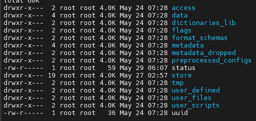
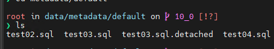

## 数据库结构


access：权限控制相关  
data： 存放数据，但是一般是软连接等  
dictionaries_lib:  
flags: 有时会有相关标志，比如强制恢复等  
format_schemas：  
metadata：存放数据库以及表的元数据,.sql文件  
metadata_dropped: 删除的queue  
store：真正存放着数据  
status： 记录着当前实例的进程ID等，用来做唯一性校验  
uuid：  

## 表启动流程
1. 读取matedata下面的.sql文件创建数据库
2. 再进入数据库文件夹遍历.sql文件创建该数据库下面的表
3. 重复 2步骤


## 表启动流程
下面跟着代码一步步往下面走，最上层根据前面构造的数据库实例去metadata下面数据库的文件夹去加载表的元数据  
  
.sql文件里面是表的sql
```
ATTACH TABLE _ UUID '46df2fc9-7ab3-44d3-8d44-3a0e525a0593'
(
    `id` Int32,
    `col1` String,
    `col2` Nullable(String),
    `create_date` DateTime64(3)
)
ENGINE = MergeTree
ORDER BY id
SETTINGS index_granularity = 8192
```

1、loadmate的代码如下：
```
    TablesLoader::Databases loaded_databases;
    for (const auto & [name, db_path] : databases)
    {
        loadDatabase(context, name, db_path, has_force_restore_data_flag);
        loaded_databases.insert({name, DatabaseCatalog::instance().getDatabase(name)});
    }
```
这个部分是将database的sql读到内存中并且创建数据库实例  

2、loadtables 构造表实例

```
    /// Read and parse metadata from Ordinary, Atomic, Materialized*, Replicated, etc databases. Build dependency graph.
    for (auto & database_name : databases_to_load)
    {
        databases[database_name]->beforeLoadingMetadata(global_context, strictness_mode);
        bool is_startup = LoadingStrictnessLevel::FORCE_ATTACH <= strictness_mode;
        databases[database_name]->loadTablesMetadata(global_context, metadata, is_startup);
    }
//(1) 将.sql文件读到内存并且解析成ast。之前145没有缓存的时候这个部分需要15分钟  
    LOG_INFO(log, "Parsed metadata of {} tables in {} databases in {} sec",
             metadata.parsed_tables.size(), databases_to_load.size(), stopwatch.elapsedSeconds());
    stopwatch.restart();
//(2) 构建依赖图
    logDependencyGraph();

    /// Remove tables that do not exist
    removeUnresolvableDependencies(/* remove_loaded */ false);

    /// Update existing info (it's important for ATTACH DATABASE)
    DatabaseCatalog::instance().addLoadingDependencies(metadata.dependencies_info);

    /// Some tables were loaded by database with loadStoredObjects(...). Remove them from graph if necessary.
    removeUnresolvableDependencies(/* remove_loaded */ true);
//(3) 按照拓扑关系 加载表
    loadTablesInTopologicalOrder(pool);             
```

在（3）中是在线程池中进行的，但是这个线程池的大小是按照CPU核心数来的，后面这个需要改写。  
中间忽略一些逻辑在StorageFactory中构造表
```
StoragePtr StorageFactory::get(
    const ASTCreateQuery & query,
    const String & relative_data_path,
    ContextMutablePtr local_context,
    ContextMutablePtr context,
    const ColumnsDescription & columns,
    const ConstraintsDescription & constraints,
    bool has_force_restore_data_flag) const
    {
        // 上面逻辑构造表引擎之类的
        ...
        auto res = storages.at(name).creator_fn(arguments);
    }
```
3、startup table
```
void TablesLoader::startupTables()
{
    /// Startup tables after all tables are loaded. Background tasks (merges, mutations, etc) may slow down data parts loading.
    for (auto & database : databases)
        database.second->startupTables(pool, strictness_mode);
}

void DatabaseOrdinary::startupTables(ThreadPool & thread_pool, LoadingStrictnessLevel /*mode*/)
{
    LOG_INFO(log, "Starting up tables.");

    ....

    try
    {
        for (const auto & table : TSA_SUPPRESS_WARNING_FOR_READ(tables))
            thread_pool.scheduleOrThrowOnError([&]() { startup_one_table(table.second); });
    }
    catch (...)
    {
        /// We have to wait for jobs to finish here, because job function has reference to variables on the stack of current thread.
        thread_pool.wait();
        throw;
    }
    thread_pool.wait();
}
```
这里的thread_pool是从上面的传进来的，所以也是根据CPU核心数来的，需要等待所有的任务跑完之后才会往下走，这里是最耗时的。  
根据不同的表引擎执行不同的startup

## replicated 表构造和startup过程
### 构造 
```
    queue_updating_task = getContext()->getSchedulePool().createTask(
        getStorageID().getFullTableName() + " (StorageReplicatedMergeTree::queueUpdatingTask)", [this]{ queueUpdatingTask(); });

    mutations_updating_task = getContext()->getSchedulePool().createTask(
        getStorageID().getFullTableName() + " (StorageReplicatedMergeTree::mutationsUpdatingTask)", [this]{ mutationsUpdatingTask(); });

    merge_selecting_task = getContext()->getSchedulePool().createTask(
        getStorageID().getFullTableName() + " (StorageReplicatedMergeTree::mergeSelectingTask)", [this] { mergeSelectingTask(); });

    /// Will be activated if we win leader election.
    merge_selecting_task->deactivate();

    mutations_finalizing_task = getContext()->getSchedulePool().createTask(
        getStorageID().getFullTableName() + " (StorageReplicatedMergeTree::mutationsFinalizingTask)", [this] { mutationsFinalizingTask(); });
    
    ...
    loadDataParts(skip_sanity_checks);

    ...
        String replica_metadata;
        const bool replica_metadata_exists = current_zookeeper->tryGet(replica_path + "/metadata", replica_metadata);

        if (!replica_metadata_exists || replica_metadata.empty())
        {
            /// We have to check shared node granularity before we create ours.
            other_replicas_fixed_granularity = checkFixedGranularityInZookeeper();

            ReplicatedMergeTreeTableMetadata current_metadata(*this, metadata_snapshot);

            current_zookeeper->createOrUpdate(replica_path + "/metadata", current_metadata.toString(),
                zkutil::CreateMode::Persistent);
        }

        checkTableStructure(replica_path, metadata_snapshot);
        checkParts(skip_sanity_checks);    
```
构造主要做了3件事：  
1. 创建任务队列监听zookeeper
2. disk加载part
3. 从zookeeper获取元数据比较本地
4. 创建restarting_thread线程

loadDataParts中加载part的数量是根据disk来的，这个不知道为什么这么做
```
void MergeTreeData::loadDataParts(bool skip_sanity_checks){
    auto disks = getStoragePolicy()->getDisks();
    ...
    ThreadPool pool(disks.size());
    for (const auto & disk_ptr : disks)
    {
        if (disk_ptr->isBroken())
            continue;

        auto & disk_parts = disk_part_map[disk_ptr->getName()];
        auto & disk_wal_parts = disk_wal_part_map[disk_ptr->getName()];

        pool.scheduleOrThrowOnError([&, disk_ptr]()...)
        {
        }
    }    
}
```

### startup
```
        startBeingLeader();

        /// In this thread replica will be activated.
        restarting_thread.start();

        /// Wait while restarting_thread finishing initialization.
        /// NOTE It does not mean that replication is actually started after receiving this event.
        /// It only means that an attempt to startup replication was made.
        /// Table may be still in readonly mode if this attempt failed for any reason.
        startup_event.wait();

        startBackgroundMovesIfNeeded();
```
1.  startBeingLeader 检查一下有没有老的leader
2.  ReplicatedMergeTreeRestartingThread 线程是在SchedulePool创建一个任务，这个任务包括：
    1.  removeFailedQuorumParts 获取/quorum/failed_parts 节点然后删除本地的该节点part
    2.  activateReplica 写自己是active
    3.  cloneReplicaIfNeeded 如果自己lost会从zookeeper拉取等操作
    4.  从zookeeper里面拉取part信息等等
3. 2完成之后这个startup主要流程结束

### 总结
主要增加的两个与线程相关的地方为：
1. TablesLoader 中加载表的线程池
2. loadDataParts 中根据disk数量来启动的线程池