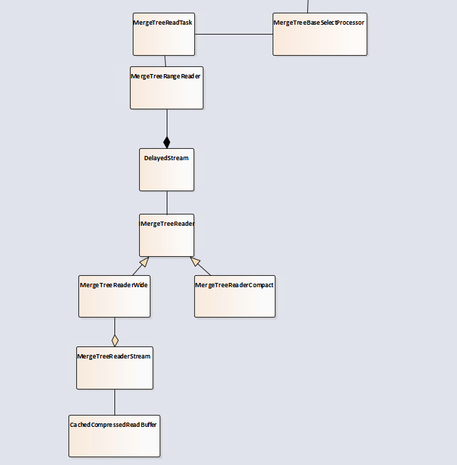

# clickhouse查询过程
## 前置条件
版本 21.3
本文主要探究命中索引
### 创建表
```
CREATE TABLE default.test
(
    `a` Int32,
    `b` Int32,
    `c` Int32,
    INDEX `idx_c` (c) TYPE minmax GRANULARITY 1
)
ENGINE = MergeTree
PARTITION BY a 
ORDER BY b
SETTINGS index_granularity=3，min_bytes_for_wide_part=0
```
### 插入数据
```
insert into default.test(a,b,c) values(1,1,1);
insert into default.test(a,b,c) values(5,2,2),(5,3,3);
insert into default.test(a,b,c) values(3,10,4),(3,9,5),(3,8,6),(3,7,7),(3,6,8),(3,5,9),(3,4,10);
```

## 索引的查询过程
markrange：在clickhouse中是用于标记区间的对象。mergetree按照index_granularity的间隔粒度，将一段完整的数据划分成了多个小的间隔数据段，一个具体的数据段既是一个完整的markrange。markrange与索引编号对应，使用start和end两个属性表示其区间范围。通过与start、end对应的索引编号的取值，即能够得到它所对应的数值区间，这个区间代表了markrange所代表的数据范围。


test表中的索引如图所示，根据`SETTINGS index_granularity=3`规则生成，每一列数据存有mark编号、offset和行数。根据索引数据，mergetree会将此数据划分成3个小的markrange，两个markrange相邻的步长为1。其中，所有markrange的最大数值区间为[4,+inf)


索引查询其实就是两个数值区间的交集判断。其中，一个区间是基于逐渐的查询条件转换而来的条件区间；另一个区间是刚才所讲述的与markrange对应的数值区间。
整个索引查询大致分为3个步骤：
1、生成条件区间：将查询条件转化为条件区间。即使是单个值也会转化为条件区间，比如
```
where a =3
[3,3]

where a >3
[a,+inf]

where a < 3
[-inf,3]
```
2、递归交集判断：以递归的形式，依次对markrange的数值区间与条件区间做交集判断。从最大的[4,+inf]开始

3、合并markrange区间：将最终匹配的markrange聚在义气，合并他们的范围。

### 索引命中流程
```
MergeTreeDataSelectExecutor::readFromParts()
{
    ...
    selectPartsToRead(parts, part_values, minmax_idx_condition, minmax_columns_types, partition_pruner, max_block_numbers_to_read);//选择分区
    ...
    std::list<DataSkippingIndexAndCondition> useful_indices;//

    for (const auto & index : metadata_snapshot->getSecondaryIndices())
    {
        auto index_helper = MergeTreeIndexFactory::instance().get(index);
        auto condition = index_helper->createIndexCondition(query_info, context);
        if (!condition->alwaysUnknownOrTrue())
            useful_indices.emplace_back(index_helper, condition);
    }
    ...
    //确定part中要读的rang
            if (metadata_snapshot->hasPrimaryKey())
            //markRangesFromPKRange这个函数在进行上述的markrange判断
                ranges.ranges = markRangesFromPKRange(part, metadata_snapshot, key_condition, settings, log);
    ...
    //根据useful_indices删除一些（本文中是skp_idx_idx_c.idx 进行 granule 过滤没用的 drop 掉）
  ranges.ranges = filterMarksUsingIndex(
                    index_and_condition.index, index_and_condition.condition,
    ...
    spreadMarkRangesAmongStreams()//生成读取的process，传入markrange
}
```

### 没有index被选中

`select * from test where a=4 and b =2`

所有的索引都匹配不到条件时会生成一个空的查询计划。
```
    if (parts_with_ranges.empty())//存的是每个part对应的markrange
        return std::make_unique<QueryPlan>();
```

### 有index命中
`select * from test where  b =4 `

```
 plan = spreadMarkRangesAmongStreams(
            std::move(parts_with_ranges),
```
会生成一个查询计划
```
        for (size_t i = 0; i < num_streams; ++i)
        {
            //生成一个查询的processor
            auto source = std::make_shared<MergeTreeThreadSelectBlockInputProcessor>(
```

具体查询代码
```
void MergeTreeReaderWide::readData()
{
    ...
                else if (!continue_reading)
                stream.seekToMark(from_mark);//移动指针
    ...
    //真正的读数据放到column里面
    name_and_type.type->deserializeBinaryBulkWithMultipleStreams(column, max_rows_to_read, deserialize_settings, deserialize_state, &cache);
}
```
uml图


堆栈如下
```
#0  DB::IDataType::deserializeBinaryBulkWithMultipleStreamsImpl (this=0x7fff31a59758, column=..., limit=3, settings=...) at ../src/DataTypes/IDataType.cpp:297
#1  0x000000001a625fdc in DB::IDataType::deserializeBinaryBulkWithMultipleStreams (this=0x7fff31a59758, column=..., limit=3, settings=..., state=..., cache=0x7fffebbeb948)
    at ../src/DataTypes/IDataType.cpp:327
#2  0x000000001b8ccdf0 in DB::MergeTreeReaderWide::readData (this=0x7fff492ea7c0, name_and_type=..., column=..., from_mark=0, continue_reading=false, max_rows_to_read=3, cache=...)
    at ../src/Storages/MergeTree/MergeTreeReaderWide.cpp:214
#3  0x000000001b8cc4f5 in DB::MergeTreeReaderWide::readRows (this=0x7fff492ea7c0, from_mark=0, continue_reading=false, max_rows_to_read=3, res_columns=...)
    at ../src/Storages/MergeTree/MergeTreeReaderWide.cpp:94
#4  0x000000001b8d8fa8 in DB::MergeTreeRangeReader::DelayedStream::readRows (this=0x7fff25519858, columns=..., num_rows=3) at ../src/Storages/MergeTree/MergeTreeRangeReader.cpp:75
#5  0x000000001b8d927d in DB::MergeTreeRangeReader::DelayedStream::finalize (this=0x7fff25519858, columns=...) at ../src/Storages/MergeTree/MergeTreeRangeReader.cpp:148
#6  0x000000001b8d9ce5 in DB::MergeTreeRangeReader::Stream::finalize (this=0x7fff25519828, columns=...) at ../src/Storages/MergeTree/MergeTreeRangeReader.cpp:259
#7  0x000000001b8dd867 in DB::MergeTreeRangeReader::startReadingChain (this=0x7fff25519800, max_rows=7, ranges=...) at ../src/Storages/MergeTree/MergeTreeRangeReader.cpp:782
#8  0x000000001b8dca1d in DB::MergeTreeRangeReader::read (this=0x7fff25519800, max_rows=7, ranges=...) at ../src/Storages/MergeTree/MergeTreeRangeReader.cpp:711
#9  0x000000001b8d5341 in DB::MergeTreeBaseSelectProcessor::readFromPartImpl (this=0x7fff2f059418) at ../src/Storages/MergeTree/MergeTreeBaseSelectProcessor.cpp:148
#10 0x000000001b8d5d4f in DB::MergeTreeBaseSelectProcessor::readFromPart (this=0x7fff2f059418) at ../src/Storages/MergeTree/MergeTreeBaseSelectProcessor.cpp:196
#11 0x000000001b8d4c9b in DB::MergeTreeBaseSelectProcessor::generate (this=0x7fff2f059418) at ../src/Storages/MergeTree/MergeTreeBaseSelectProcessor.cpp:59
#12 0x000000001bb20b30 in DB::ISource::tryGenerate (this=0x7fff2f059418) at ../src/Processors/ISource.cpp:79
#13 0x000000001bb208c4 in DB::ISource::work (this=0x7fff2f059418) at ../src/Processors/ISource.cpp:53
#14 0x000000001be840fd in DB::SourceWithProgress::work (this=0x7fff2f059418) at ../src/Processors/Sources/SourceWithProgress.cpp:36
#15 0x000000001bb7e1b9 in DB::executeJob (processor=0x7fff2f059418) at ../src/Processors/Executors/PipelineExecutor.cpp:79
#16 0x000000001bb7e12f in DB::PipelineExecutor::addJob(DB::ExecutingGraph::Node*)::$_0::operator()() const (this=0x7fff25018070) at ../src/Processors/Executors/PipelineExecutor.cpp:96
```