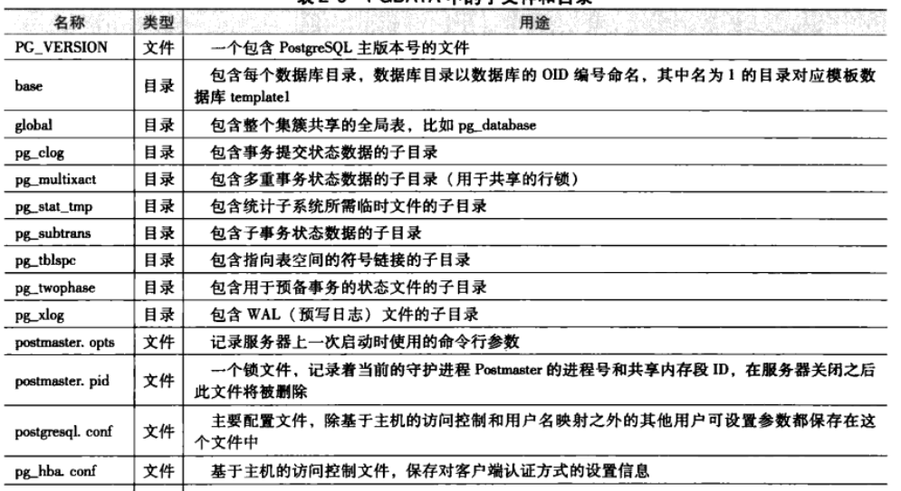
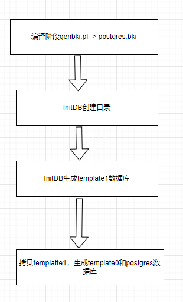
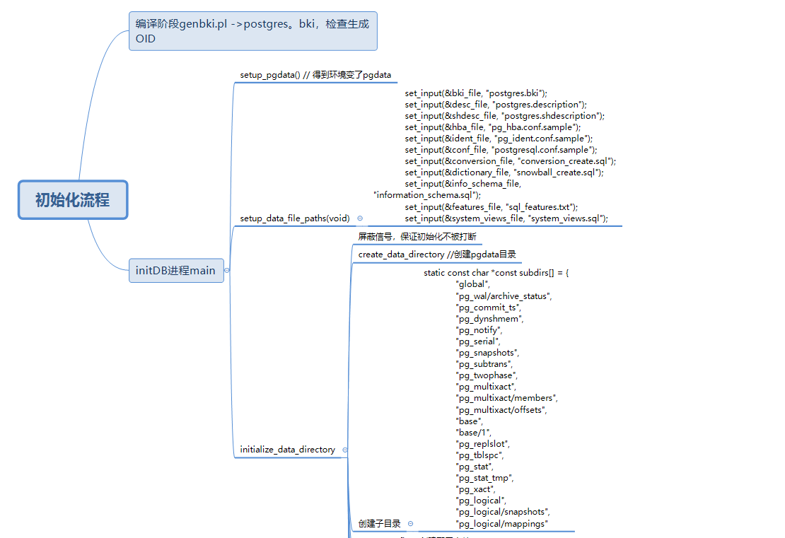
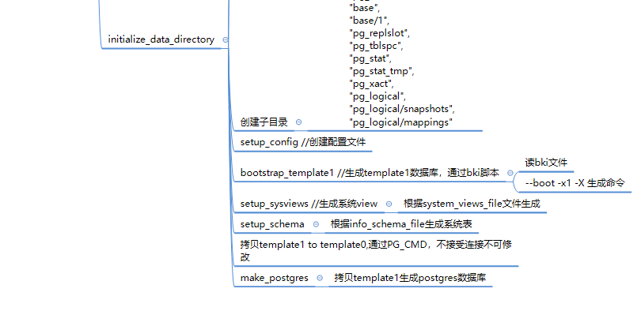

# 数据集簇
    postgre所有数据存储在数据目录里，通常会用环境变量PGDATA来引用。
    在postgre中，对象标识符（OID）用来在整个数据集簇中唯一地标识一个数据库对象，可以是数据库、表、索引、试图、元组、类型等，它实际是一个无符号整数。

    对于某个具体的数据库，在PGDATA/base对应一个子目录，子目录名字是该数据库在系统表pg_database里的oid。索引和表都存在该数据库目录下，以该表或者索引的filenode号命名，该号码记录在该表或索引在系统表pg_class中对应元组的relfilenode属性中。



 
## PostgreSQL 进程结构
postmaster 守护进程  
syslogger 系统日志进程  
pgstat 统计数据收集进程  
autovacuum 系统自动清理进程  
bgwriter 后台写进程  
walwriter 预写式日志进程  
pgarch 预写式日志归档进程  

    调用接口库odbc、libpq把请求转发到postmaster，postmaster启动新的进程postgres服务。postmaster及其子进程通过共享内存和信号进行通信。

# InitDB过程
  
    初始化包括创建包含数据库系统所有数据的数据目录、创建哦那个想的系统表、创建其他的配置文件和控制文件，并创建三个数据库：模板数据库template1、template0、默认的用户数据库postgres。之后创建新的数据库是，template1数据库里的所有内容都会拷贝过来。template0和postgres都是通过拷贝template1创建的。

## postgres.bki

    由src/backend/catalog目录下的脚本genbki.sh读取/src/include/catalog下.h文件，并通常存放在安装书的share子目录下

## InitDB初始化详细流程




## pg启动停止
`pg_ctl -D /home/yh/code/PostgreSQL/pgdata -l /home/yh/code/PostgreSQL/pgdata/log1 start`

`pg_ctl -D /home/yh/code/PostgreSQL/pgdata -l /home/yh/code/PostgreSQL/pgdata/log1 stop`

## 常用命令
连接数据库
`psql -p 6688 -d postgres`
```
\l 列出所有数据库
\? 获取所有命令
\dt 列出所有表
```

ctrl x+a 带代码调试
## 比较重要的文件
pg_controldata 里面的checkpoint可以用来恢复  
pg_config 查看config，可以排查哪里的配置未生效  

## 配置文件
vim pgdata/postgresql.conf
```
listen_addresses = '*'          # what IP address(es) to listen on;
port = 6688

logging_collector = on
log_directory = 'log'
log_filename = 'postgresql-%a.log'
log_error_verbosity = verbose
log_timezone = 'PRC'

```


