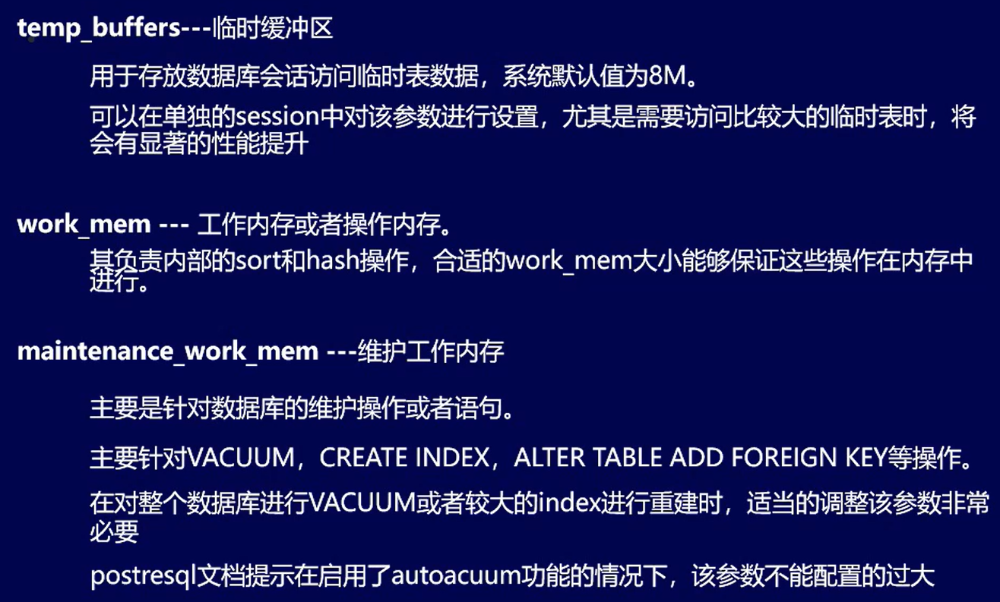
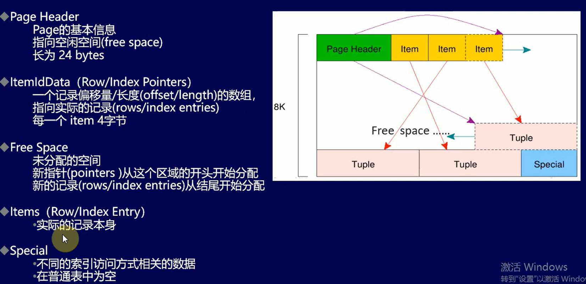
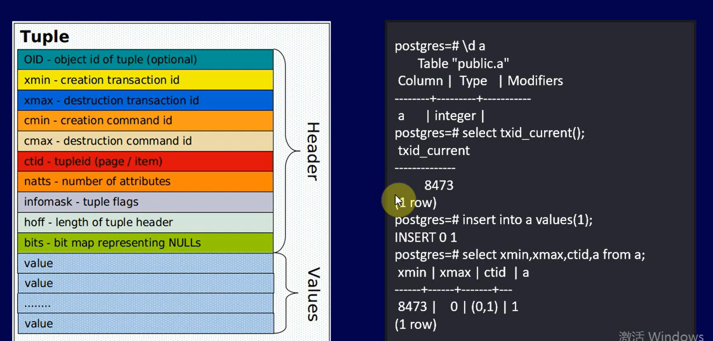

## 共享内存区
1. shared_buffers 共享缓冲区
   标识缓冲区中的数据块个数，每个数据块大小8k。位于数据库共享内存中，越大越好，不能小于128k
2. wal_buffers 日志缓存区大小
   可以降低IO，如果遇上比较多的并发短事务，应该和commit_delay一起用

## 进程私有内存

## 配置文件
pg_hba.config  
    和连接相关的权限配置，文件存放在Data目录下。文件中每一行为一条配置，每条配置中包括连接类型、数据库、用户给、客户端地址和认证方式几个字段  
postgresql.conf  
pgsql的配置参数时这个文件集中管理的，文件存放在data目录下  
postgresql_auto.conf  
和postgresql.conf格式相同，但不允许手动编辑，需要通过alter system命令设置。  

## 空闲空间映射（FSM）

## 可见性映射

## 物理结构
找到该表的物理路径  
 `select pg_relation_filepath('a'::regclass);`

## 页结构

## 物理结构
一行数据-tuple数据结构
