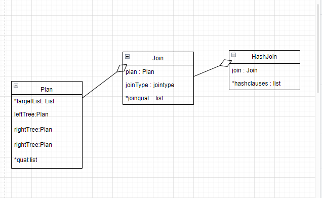
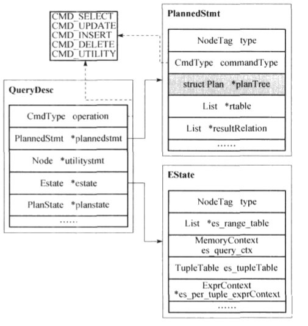
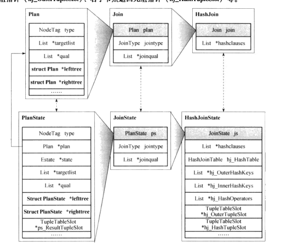
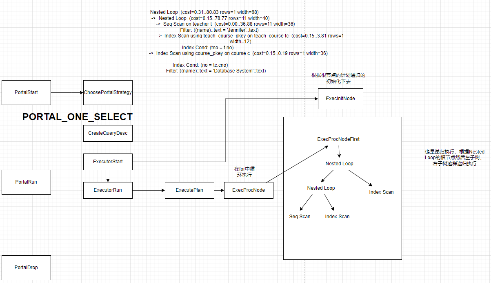

## 处理模型
物理查询计划有操作符构造，每一个操作符实现计划中的一步。物理操作符常常是一个关系代数操作符的特定实现。但是，我们也需要用物理操作符来实现硬一些与关系代数操作符无关的任务。此次操作符构造的物理计划就是物理代数表达的查询计划，操作符在postgresql中使用一种节点定义，无关的任务为表的扫描排序。  
在postgresql中上层通过execinitnode、execprocnode、execendnode三个接口函数来统一对节点进行初始化、执行、清理操作，这三个操作都是递归进行的。  
总结一下，在postgresql中查询计划书是由哥哥物理操作符（计划节点）构成。
## 计划节点
控制节点  
扫描节点  
物化节点  
连接节点  

## 操作符的数据结构
扫描和连接还定义了公告父类Scan、Join。hash属于连接节点，所以继承了join



QueryDesc：  
作为执行器的输入，包含查询计划树plannedstmt、功能与据相关执行计划utilitystmt、计划节点执行状态planstate。  
执行器全局状态estate：  
查询计划的范围表es_range_table、所在的内存上下文、节点之间传递元组的全局元组表和每获得一个元组就会回收的内存上下文es_per_tuple_exprContext



执行器初始化时，executorstart会根据查询计划书构造执行器全局状态estate以及计划节点执行状态planstate。执行器使用planstate来记录计划节点执行状态和**数据**。每个计划节点都有一个状态节点，每个plan都对应有一个planstate

  
所有状态继承于planstate，各个字段含义：辅助计划节点指针（plan）、执行器全局状态指针（state）、投影运算相关信息（targetlist）、选择运算相关条件（qual），左右子状态节点指针（lefttree、righttree）有点像节点状态树。  
```
总结：  
执行器输入querydesc，包含了查询计划根节点的指针plannedstmt。首先构造全局状态记录Estate结构，并会每个计划节点构造对应的状态节点（plan -> planstate），执行过程中数据存储在planstate中
```

## Executor驱动ExecProcNode
执行策略会根据查询编译器给出的查询计划链表来为当前查询选择四种执行策略中的一种，用portal这个数据结构标识。



上层节点（Nested Loop）首先执行，执行是通过自己的两个子节点（Nested loop、Index Scan）拿到数据，子节点又通过自己的子节点拿到数据。这样层层驱动整个计划树的运行。和pull模型执行逻辑也是类似的，不过这个时根据root节点来驱动数据往下进行