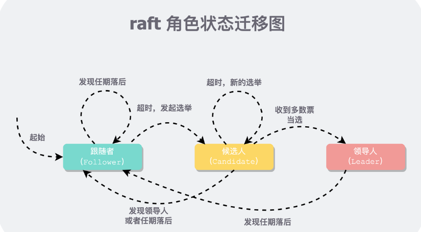

# 说在前面
本节主要记录实现raft领导者选举部分实现的新的以及注意要点，实现语言采用go来实现想用c++来实现但是由于要用到RPC之类的东西，总的来说还是go最方便，就还是采用go来实现了  

## 领导者选举逻辑
1. 状态转换：分为3个角色leader/follower/candidate，初始状态为follower当超时的时候转换为candidate然后发起选举
2. 选举逻辑：按照论文定义相关结构体周期性的发起请求
3. 心跳逻辑：定义RPC县官结构体leader选出来后发起心跳给follower

### 相关代码
```
type Raft struct {
        mu        sync.Mutex          // 只有这一把锁
        peers     []*labrpc.ClientEnd // RPC end points of all peers
        persister *Persister          // Object to hold this peer's persisted state
        me        int                 // this peer's index into peers[]
        dead      int32               // set by Kill()

        
        role        Role 
        currentTerm int //任期
        votedFor     int //-1 表示未投票

        // used for election loop
        electionStart   time.Time 
        electionTimeout time.Duration //超时时间随机
}

func (rf *Raft) becomeFollowerLocked(term int) {
        if term < rf.currentTerm {
                LOG(rf.me, rf.currentTerm, DError, "Can't become Follower, lower term")
                return
        }

        LOG(rf.me, rf.currentTerm, DLog, "%s -> Follower, For T%d->T%d", 
            rf.role, rf.currentTerm, term)
            
        if term > rf.currentTerm { 
                rf.votedFor = -1
        }
        rf.role = Follower
        rf.currentTerm = term
}

func (rf *Raft) becomeCandidateLocked() {
        if rf.role == Leader {
                LOG(rf.me, rf.currentTerm, DError, "Leader can't become Candidate")
                return
        }

        LOG(rf.me, rf.currentTerm, DVote, "%s -> Candidate, For T%d->T%d", 
            rf.role, rf.currentTerm, rf.currentTerm+1)
        rf.role = Candidate
        rf.currentTerm++
        rf.votedFor = rf.me
}

func (rf *Raft) becomeLeaderLocked() {
        if rf.role != Candidate {
                LOG(rf.me, rf.currentTerm, DLeader, 
                    "%s, Only candidate can become Leader", rf.role)
                return
        }

        LOG(rf.me, rf.currentTerm, DLeader, "%s -> Leader, For T%d", 
            rf.role, rf.currentTerm)
        rf.role = Leader
}
```
### 状态迁移图
  
按照图中所展示的一旦follower发生超时那么它就会转化为candidate发起选举，下面解释下选举的要票逻辑

## 要票逻辑
1. 单论选举：超时之后针对所有的peer发起一次要票过程
2. 单次RPC：针对每个peer的requestVote的请求和相应处理，进行计票

### 选举的loop逻辑
每次在选举的loop前要进行检查：
1. 超时检查，这里超时时间是随机的每一个peer都是不一样的，避免同是发起选举
2. 角色检查：如果自己是leader了就不发起选举了
   
### 单轮选举
```
type RequestVoteArgs struct {
	Term        int
	CandidateId int
}


type RequestVoteReply struct {
	Term        int
	VoteGranted bool
}
```
单论选举针对除自己以外所有的peer的一轮要票RPC，由于需要访问全局变量需要加锁，并且不能在持有锁的时候同步的进行RPC。需要使用goroutine异步地对每个peer进行PRC  
```
func (rf *Raft) startElection(term int) bool {
        votes := 0
        askVoteFromPeer := func(peer int, args *RequestVoteArgs) {
                // to do,send rpc and handle the response
        }

        rf.mu.Lock()
        defer rf.mu.Unlock()

        // every time locked 
        if rf.contextLostLocked(Candidate, term) {
                // 每当线程新进入一个临界区时，要进行 Raft 上下文的检查。如果 Raft 的上下文已经被更改，要及时终止 goroutine，避免对状态机做出错误的改动。
                return false
        }

        for peer := 0; peer < len(rf.peers); peer++ {
                if peer == rf.me { 
                        votes++
                        continue
                }

                args := &RequestVoteArgs{
                        Term:        term,
                        CandidateId: rf.me,
                }
                go askVoteFromPeer(peer, args)
        }

        return true
 }
```
### 单次RPC逻辑
单次 RPC 包括构造 RPC 参数、发送 RPC等待结果、对 RPC 结果进行处理三个部分  
```
askVoteFromPeer := func(peer int, args *RequestVoteArgs) {
...
        // align the term
        if reply.Term > rf.currentTerm {
                rf.becomeFollowerLocked(reply.Term)
                return
        }

        // check the context
        if rf.contextLostLocked(Candidate, term) {
                LOG(rf.me, rf.currentTerm, DVote, "Lost context, abort RequestVoteReply in T%d", rf.currentTerm)
                return
        }

        // count votes
        if reply.VoteGranted {
                votes++
        }
        if votes > len(rf.peers)/2 {
                rf.becomeLeaderLocked()
                go rf.replicationTicker(term)
        }
}
```

### 给票逻辑
主要逻辑如下：  
1. 判断任期，如果小于自己任期直接拒绝，大于的话直接变为follower
2. 已经投了票了直接拒绝
3. 投票给candidate然后重置超时时间

## 心跳逻辑
在论文中心跳（不带日志）和日志复制是用的一个 RPC，毕竟他们在逻辑上唯一的区别就是带不带日志。  
和选举逻辑相对，我们也分三个层次来实现 RPC 发送方：
1. 心跳 Loop：在当选 Leader 后起一个后台线程，等间隔的发送心跳/复制日志，称为 replicationTicker
2. 单轮心跳：对除自己外的所有 Peer 发送一个心跳 RPC，称为 startReplication
3. 单次 RPC：对某个 Peer 来发送心跳，并且处理 RPC 返回值，称为 replicateToPeer

### 心跳loop
```
func (rf *Raft) replicationTicker(term int) {
        for !rf.killed() {
                ok := rf.startReplication(term)
                if !ok {
                        return
                }

                time.Sleep(replicateInterval)
        }
}
```
### 单轮心跳
和 Candidate 的选举逻辑类似，Leader 会给除自己外的所有其他 Peer 发送心跳。在发送前要检测“上下文”是否还在，如果不在了，就直接返回 false ——告诉外层循环 replicationTicker 可以终止循环了。  
要注意的逻辑只有一个和上文讲到的一样在进入routine之后要checkContext检验是否还是leader  
### 单次 RPC
在不关心日志时，心跳的返回值处理比较简单，只需要对齐下 term 就行。如果后续还要进行其他处理，则还要检查 context 是否丢失。  
### 心跳接收端逻辑
心跳接收方在收到心跳时，只要 Leader 的 term 不小于自己，就对其进行认可，变为 Follower，并重置选举时钟，承诺一段时间内不发起选举。
```
func (rf *Raft) AppendEntries(args *AppendEntriesArgs, reply *AppendEntriesReply) {
        rf.mu.Lock()
        defer rf.mu.Unlock()

        reply.Term = rf.currentTerm
        reply.Success = false
        // align the term
        if args.Term < rf.currentTerm {
                LOG(rf.me, rf.currentTerm, DLog2, "<- S%d, Reject log", args.LeaderId)
                return
        }
        rf.becomeFollowerLocked(args.Term)
        

        // reset the timer
        rf.resetElectionTimerLocked()
        reply.Success = true
}
```